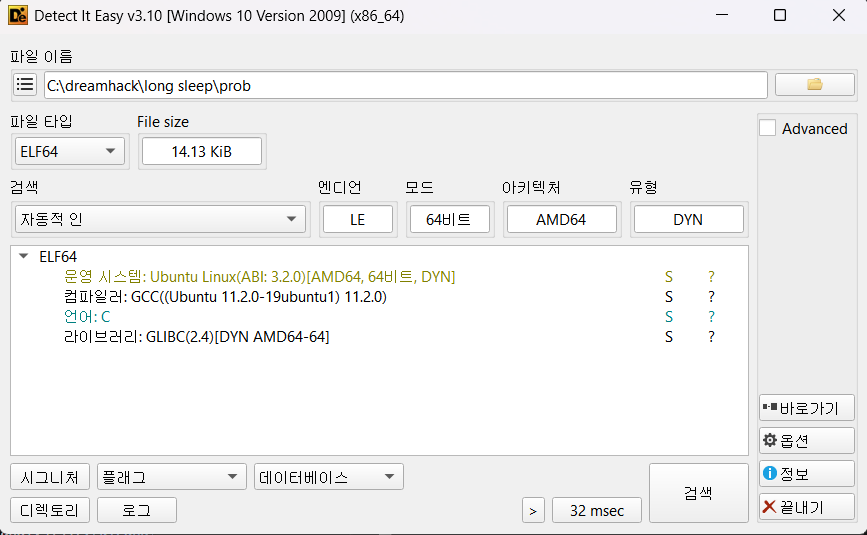
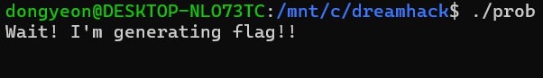
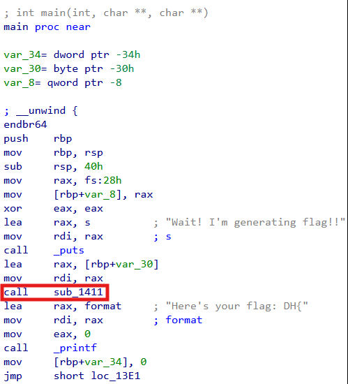
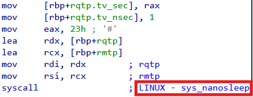
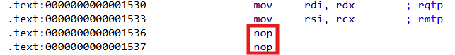
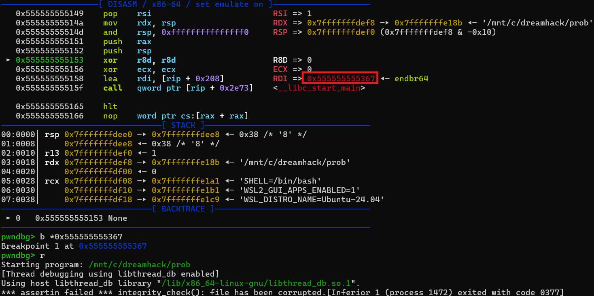
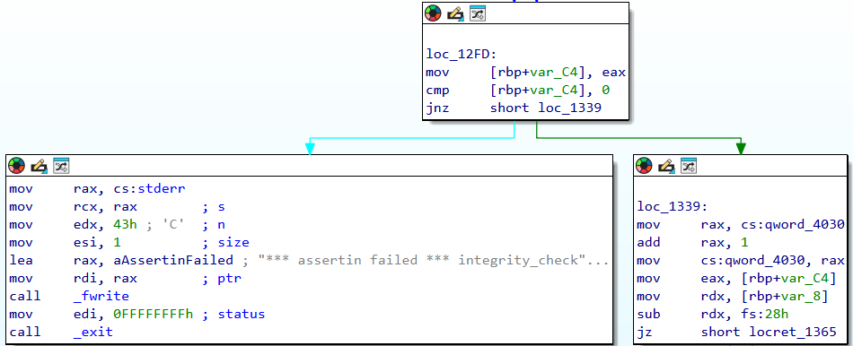
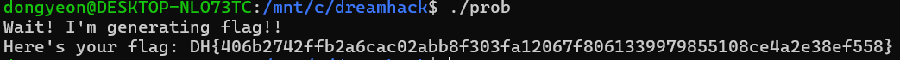

# Dreamhack: Long Sleep Write-up

## 1. Problem Overview
- **Category:** Reversing
- **Difficulty:** Level 2
- **Tool:** IDA Free, ununtu,DIE
- **Description:** 실행 후 대기상태에 빠지는 프로그램을 플래그를 출력하게 만드는 문제

## 2. Static Analysis (정적 분석)
### 2.1. Initial Analysis
제공된 **prob** 파일에 확장자가 없어 파일 형식을 식별하기 위해 정적 분석 도구인 DIE (Detect It Easy) 를 사용했습니다. 분석 결과, 해당 파일이 리눅스 실행 파일(ELF 64-bit)임을 확인했습니다.

Reference: DIE는 실행 파일의 컴파일러, 패커, 파일 형식 등을 상세히 알려주는 도구입니다.

이후 ubuntu를 사용해 리눅스환경에서 프로그램을 실행하여 동작을 확인했습니다.

**Wait! I'm generating flag!!** 라는 문자열이 출력되고 프로그램이 계속 실행중인것을 확인할 수 있습니다.
이에 저는 프로그램을 멈추는 sleep계열의 시스템 콜이나 무한 루프가 있을것이라고 가설을 내렸습니다.

### 2.2 Main Logic Finding & Solution
**Wait! I'm generating flag!!**  문자열을 Cross Reference (Xref) 하여 메인 로직이 위치한 함수를 찾았습니다.

프로그램은 **Wait! I'm generating flag!!** 까지만 실행하고 **Here's your flag~~** 까지는 출력을 못 하니 
**call sub_1411** 에서 프로그램을 멈추는 역할을 하는 함수가 숨어있을 것이라 판단했습니다.

분석과정에서 **nanosleep** 이라는 처음보는 함수를 발견했습니다. 

**nanosleep** : 리눅스 시스템 콜(System Call) 중 하나, 프로그램의 실행을 지정된 시간만큼 중지시키는 함수. 
일반적인 sleep() 함수가 초 단위로 제어하는 것과 달리, 나노초 단위의 시간 제어가 가능

**nanosleep**이 프로그램을 멈추는 핵심함수라고 판단하여 **nanosleep**을 호출하는 **syscall**을 nop으로 패치했습니다.
패치방법: **syscall**이 2byte짜리 명령어여서 **nop**(1byte)을 **syscall**이 시작하는 주소에 두 번 넣어줬음

패치 후 실행을 했더니 아래와 같은 결과가 나왔습니다.
실행 도중 무결성 검사 함수가 동작해서 **assertion failed** 에러가 발생하며 프로그램이 종료되었습니다.  
즉 프로그램 내부에서 자기 자신의 코드를 스캔하는데 앞서 nanosleep 우회를 위해 바이너리를 패치한 흔적이 감지되어 
처음 프로그램원본과 다르다고 판단되어 실행을 차단한 것입니다.

무결성 검사 함수인 **integrity_check**함수 자체를 우회하면 **nanosleep 우회**가 막히지 않을거라 판단하여
아래 **jnz short loc_1339** 를 **jz short loc_1339**로 패치해주었습니다.

패치 후 실행결과입니다.

## 3. Result
플래그 추출 성공: `DH{9ce745c0d5faaf29b7aecd1a4a72bc86}`

## 4. Thoughts

