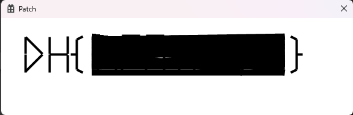
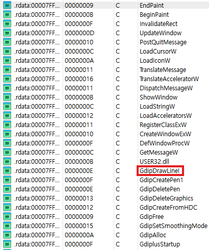
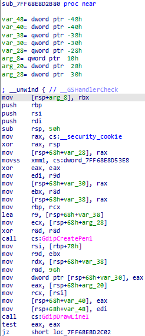
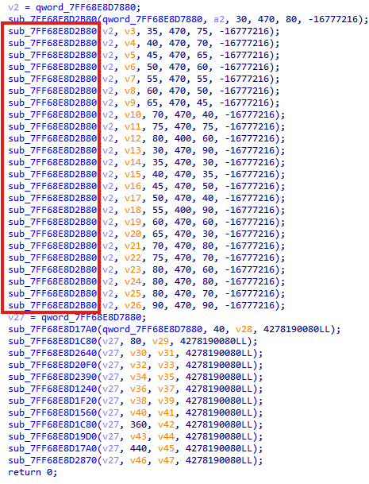
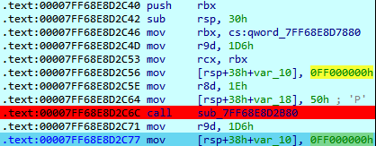
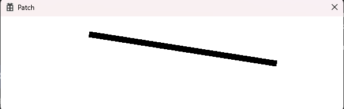
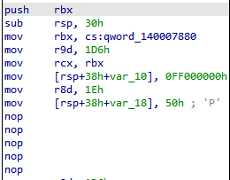
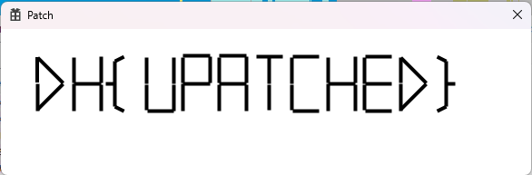

# Dreamhack: Patch Write-up

## 1. Problem Overview
- **Category:** Reversing
- **Difficulty:** Level 2
- **Tool:** IDA Free
- **Description:** 가려진 Flag가 보이도록 바이너리를 Patch하는 문제

## 2. Static Analysis (정적 분석)
### 2.1. Initial Analysis
문제 파일인 flag.exe를 실행해보니, 아래 이미지와 같이 플래그가 있어야 할 위치가 검은색 선들로 덧칠된 것처럼 가려져 있었습니다.
이 현상을 관찰하고, **플래그 위에 덧칠하는 함수가 반복적으로 호출되고 있을 것이다**이라는 초기 가설을 세웠습니다.

가설을 검증하기 위해 IDA로 파일을 열어 정적 분석을 시작했습니다. 

프로그램이 어떤 기능을 사용하는지 파악하고자 Strings 탭을 확인한 결과, 다수의 Win32 API 함수들이 사용된 것을 볼 수 있었습니다.

함수 목록 중에서 저는 특히 **GdipDrawLine** 이라는 함수에 주목했습니다.

**GdipDrawLine**함수는 **두 점을 잇는 직선**을 그리는 함수로 연속해서 호출한다면 문제처럼 마구 칠해서 가리는 용도로 쓸 수 있을거라 판단했습니다.

Reference: **win32api는 프로그램이 윈도우 운영체제(OS)에게 특정 작업(화면 출력, 창 제어, 파일 읽기 등)을 요청할 때 사용하는 공식 함수 인터페이스입니다.**

### 2.2. Main Logic Finding & Solution
**GdipDrawLine** 함수를 Cross Reference (Xref) 하여 메인 로직이 위치한 함수를 찾았습니다.

핵심 로직은 다음과 같습니다. 아래 그림을 보면 **sub_7FF68E8D2B80**함수가 반복적으로 호출되는것을 볼 수 있습니다.

**sub_7FF68E8D2B80**이 flag를 가리며 덧칠을 하는 함수라고 판단하고 처음 호출되는 **sub_7FF68E8D2B80**에 breakpoint를 설정하고
디버깅(f9)해보았습니다.

**sub_7FF68E8D2B80**가 실행될 때마다 화면에 검은 줄이 하나씩 그어지는 것을 확인할 수 있었습니다. 이로써 **sub_7FF68E8D2B80**가 **flag를 가리는 역할**을 한다는 가설이 검증되었습니다.

문제를 해결하기 위해 해당 **sub_7FF68E8D2B80** 호출을 무력화하기로 결정했습니다. **sub_7FF68E8D2B80** 명령어는 총 5 Byte의 크기를 가집니다. 
따라서 아무런 동작을 하지 않는 1 Byte 명령어인 NOP을 5번 입력하여, 원본 프로그램의 구조를 해치지 않고 해당 함수 호출부만 패치했습니다.

패치된 파일을 실행한 결과, 아래 그림과 같이 덧칠하는 루틴이 사라지며 숨겨져 있던 플래그가 선명하게 드러났습니다.

## 3. Result
플래그 추출 성공: `DH{UNPATCHED}`

## 4. Thoughts
처음에는 IDA에 디버깅기능이 있다는 것을 모르고 코드를 수정한 뒤 저장하고 실행해보는 과정을 반복하여 시간낭비를 했습니다.
하지만 IDA의 Local Debugger 기능을 알게 된 후 Breakpoint를 활용하여 로직을 실시간으로 검증할 수 있었고 풀이 시간을 크게 단축할 수 있었습니다.
초반에는 Win32 API 함수들이 낯설어 분석에 어려움이 있었으나, **GdipDrawLine**의 핵심 기능을 파악하고 패치하는 과정에서 리버싱의 큰 재미를 느꼈습니다. 
이 문제를 통해 동적 분석을 병행하는것이 중요하다는것을 배웠습니다.

