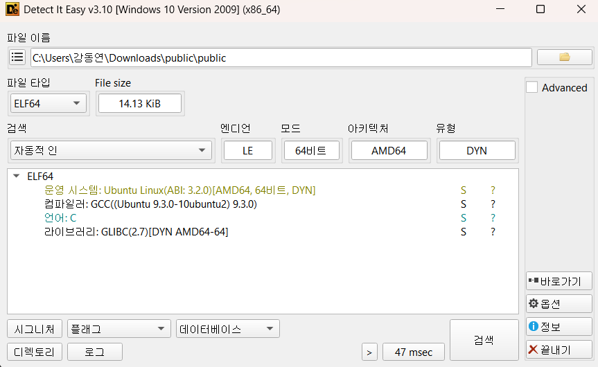
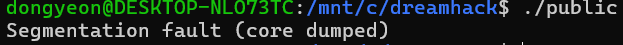
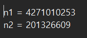
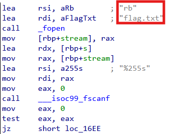
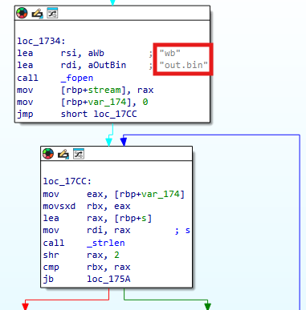
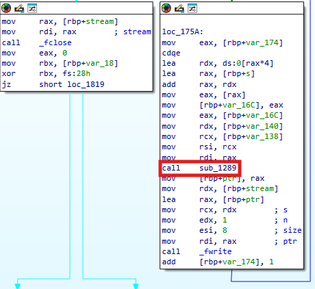
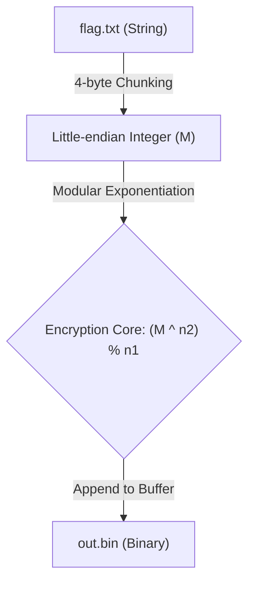
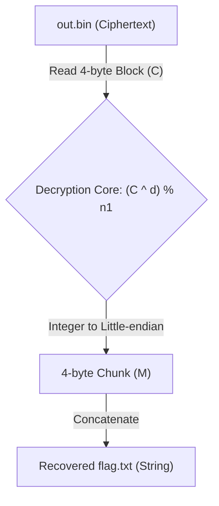
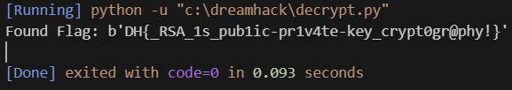

# Dreamhack: Public Write-up

## 1. Problem Overview
- **Category:** Reversing
- **Difficulty:** Level 2
- **Tool:** IDA Free, VS Code (Pyhon), Ubuntu, DIE
- **Description:** 암호화된 flag를 복호화하는 문제

## 2. Static Analysis (정적 분석)
### 2.1. Initial Analysis
제공된 public 파일에 확장자가 없어 파일 형식을 식별하기 위해 정적 분석 도구인 DIE (Detect It Easy) 를 사용했습니다. 분석 결과, 해당 파일이 리눅스 실행 파일(ELF 64-bit)임을 확인했습니다.

Reference: DIE는 실행 파일의 컴파일러, 패커, 파일 형식 등을 상세히 알려주는 도구입니다.



이후 Ubuntu를 사용해 리눅스환경에서 프로그램을 실행하여 동작을 확인했습니다.

 **Segmentation falut (core dumped)** 를 확인했습니다.




다운로드 받은 폴더에는 public 리눅스 파일 뿐 아니라 **out.bin**파일과 **out.txt**파일이 있었습니다.

**out.bin**파일은 알 수 없는 문자들로 암호회되어 있는것을 볼 수 있었습니다.


**out.txt**파일은 문제의 키가 될수도 있는 n1과 n2값을 알려줍니다.




### 2.2 Main Logic Finding
**out.bin** 문자열을 Cross Reference (Xref) 하여 메인로직이 있는 함수를 찾았습니다.

**flag.txt**를 **rb**모드로 **fscanf**을 통해 받아오는것을 볼 수 있습니다. 




**flag.txt**의 데이터를 읽어 암호화한 뒤 out.bin에 기록하는 전체 로직을 파악했습니다.

이에 따라 분석된 암호화 함수를 코드로 재구성하고, 이를 역연산하여 데이터를 원상복구 하는 복호화 스크립트 작성을 최종 목표로 설정했습니다.



**call sub_1289**함수를 통해 나온 결과값을 **_fwrite**를 통해서 **out.bin**에 기록하는것을 보고
**call sub_1289**이 암호화 함수라는 결론을 내렸습니다.



**flag.txt**를 구하기 위해서는 암호화함수인 **sub_1289**뿐만이 아니라 주변 어셈블리들도 분석하여
역연산함수를 만들어야합니다.

**sub_1289**의 동작을 중심으로 분석했습니다.

### **main함수의 일부분** Stack Frame & Register Setup
| Register / Memory | Variable Name (내 방식) | Description |

| `[rbp+stream]` | `out.bin addr` | out.bin file address |

| `[rbp+var_174]` | `i` | loop counter |

| `[rbp+s]` | `flag.txt addr` | flag.txt file address |

| `[rbp+140]` | `n1` | n1 |

| `[rbp+138]` | `n2` | n2 |

### Assembly Logic 
```assembly

loc_1734:
    lea     rsi, aWb                    ; "wb"
    lea     rdi, aOutBin                ; "out.bin"
    call    _fopen                                
    mov     [rbp+stream], rax			;[rbp+stream]=out.bin addr
    mov     [rbp+var_174], 0			;index=0
    jmp     short loc_17CC
loc_17CC:
    mov     eax, [rbp+var_174]			;eax=index
    movsxd  rbx, eax					;rbx=index
    lea     rax, [rbp+s]				;rax=flag.txt addr
    mov     rdi, rax            		;rdi=flag.txt addr
    call    _strlen					    ;rax=strlen(flag)
    shr     rax, 2					    ;rax=strlen(flag)>>2
    cmp     rbx, rax					;if (index < strlen(flag)>>2) jmp loc_175A 
    jb      loc_175A

loc_175A:
    mov     eax, [rbp+var_174]			;eax=index
    cdqe
    lea     rdx, ds:0[rax*4]			;rdx=index*4
    lea     rax, [rbp+s]				;rax=flag.txt addr
    add     rax, rdx					
    mov     eax, [rax]					;eax=flag[4*i]
    mov     [rbp+var_16C], eax			;[rbp+var_16C]=flag[4*i]
    mov     eax, [rbp+var_16C]			;eax=flag[4*i]
    mov     rdx, [rbp+var_140]			;rdx=n1
    mov     rcx, [rbp+var_138]			;rcx=n2
    mov     rsi, rcx					;rsi=n2				
    mov     rdi, rax					;rdi=flag[4*i]
    call    sub_1289					;sub_1289(flag[4*i],n2,n1)
    mov     [rbp+ptr], rax				;[rbp+ptr]=(flag[4*i]^n2)mod n1
    mov     rdx, [rbp+stream]           ;rdx=out.bin addr
    lea     rax, [rbp+ptr]              ;rax=[rbp+ptr] addr
    mov     rcx, rdx                    ; s            
    mov     edx, 1                      ; n
    mov     esi, 8                      ; size
    mov     rdi, rax                    ; ptr
    call    _fwrite    
    add     [rbp+var_174], 1            ;index++

```

### **sub_1289** Stack Frame & Register Setup
| Register / Memory | Variable Name (내 방식) | Description |

| `[rbp+var_28]` | `n1` | modulo value |

| `[rbp+var_20]` | `n2` | exponent value |

| `[rbp+var_18]` | `flag[4*i]` | flag.txt 4byte chunk |

| `[rbp+var_10]` | `result` | return value |

| `[rbp+var_8]` | `cnt` | loop counter |

### Assembly Logic 
```assembly

    push    rbp
    mov     rbp, rsp
    sub     rsp, 30h                    
    mov     [rbp+var_18], rdi			;[rbp+var_18]=flag[4*i]
    mov     [rbp+var_20], rsi			;[rbp+var_20]=n2
    mov     [rbp+var_28], rdx			;[rbp+var_28]=n1
    cmp     [rbp+var_28], 0				;if (n1==0) jump loc_12B2
    jnz     short loc_12B2

loc_12B2:
    mov     [rbp+var_10], 1				;result=1
    mov     [rbp+var_8], 0				;cnt=0
    jmp     short loc_12EE

loc_12EE:
    mov     rax, [rbp+var_8]			;cnt=0
    cmp     rax, [rbp+var_20]			;if (cnt<n2) jump loc_12C4
    jb      short loc_12C4
    mov     rax, [rbp+var_10]			;retrun result
    leave
    retn
; } // starts at 1289
sub_1289 endp

loc_12C4:
    mov     rax, [rbp+var_10]			;rax=result
    imul    rax, [rbp+var_18]			;rax=result*flag[4*i]
    mov     [rbp+var_10], rax			;result=result*flag[4*i]
    cmp     [rbp+var_28], 0				;n1==0
    jz      short loc_12E9
    mov     rax, [rbp+var_10]			;rax=result
    mov     edx, 0					    ;edx=0
    div     [rbp+var_28]				;rax=result/n1, rdx=result%n1	
    mov     [rbp+var_10], rdx			;result=result%n1

loc_12E9:
    add     [rbp+var_8], 1				;cnt+=1

result=(flag[4*i]^n2)%n1
```


## Encoding Logic
분석 결과 프로그램은 flag.txt의 원본 데이터를 읽어 들여 RSA 공개키 암호화 알고리즘을 적용한 뒤 out.bin 파일에 작성하는 구조를 가지고 있습니다.

데이터는 한 번에 처리되지 않고, 4-byte(Little-endian) 단위로 슬라이싱되어 정수형(Integer)으로 변환된 후 암호화 과정을 거칩니다.

암호화 공식: $C = M^{n_2} \pmod{n_1}$

$M$: 4바이트 단위의 평문 블록 (Message)

$n_2$: RSA 공개 지수 (Public Exponent, $e$)

$n_1$: 모듈러스 (Modulus, $N$)

$C$: 암호화된 결과값 (Ciphertext)

    

암호화 로직을 바탕으로 복호화 로직도 다이어그램으로 만들었습니다.

## Decoding Logic
암호화된 out.bin을 복구하기 위해서는 개인키(Private Key)인 **$d$** 가 필요합니다. 

이를 위해 모듈러스($n_1$)를 두 개의 소수($p, q$)로 분해하여 오일러 피 함수($phi$)를 구하는 과정을 거쳤습니다.

**private key(d) 연산 과정**

1, 소인수분해 (Factoring): $n_1 = p \times q$ 를 만족하는 두 소수를 찾아냅니다.

2, 오일러 피 함수 계산: $\phi(n_1) = (p-1)(q-1)$

3, 개인키 생성: 공개지수 $n_2$의 모듈러 역수를 구합니다.

**복호화 공식**

추출된 개인키 $d$를 사용하여 각 4바이트 블록을 평문으로 복원했습니다..

**$$M = C^d \pmod{n_1}$$**



## 3. Solution (풀이 과정)
앞서 분석한 복호화 로직을 바탕으로 out.bin에서 원본 플래그를 추출하는 파이썬 스크립트를 작성했습니다.

### Full Solver Code
[solution](./solution.py) 파일을 참고하세요.

## 4. Result


## 5. Thoughts
처음에는 주요 로직을 분석했을때 그냥 다른 암호화문제들이랑 다를게 없어서 쉽다생각했는데, modulo연산과 지수계산이 섞인 연산을 역연산하려니까 
못 풀겠어서 구글링을 했더니 RSA 암호화 알고리즘이라는것을 알게되었고 **소인수분해**와 inverse계산을 통해서 privatekey를 찾는것이 핵심이었다.
암호학의 기초인 RSA알고리즘을 알게되었는데 진짜 쉽지않았다.


