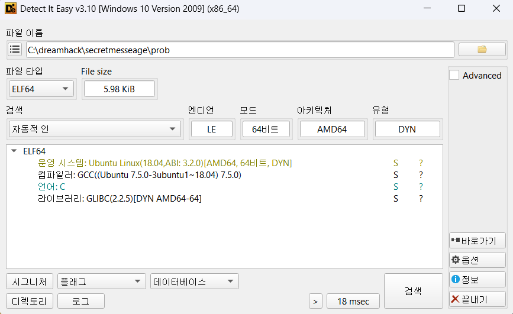
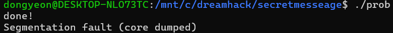
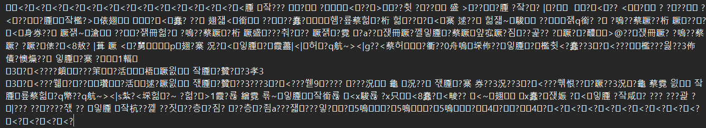
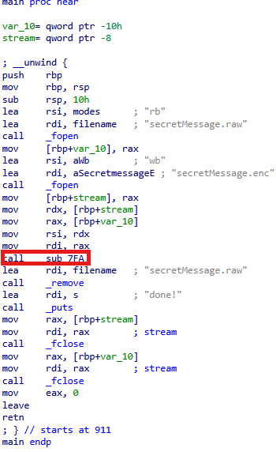
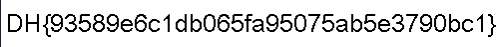

# Dreamhack: Secret Message Write-up

## 1. Problem Overview
- **Category:** Reversing
- **Difficulty:** Level 2
- **Tool:** IDA Free, VS Code (Pyhon), Ubuntu, DIE
- **Description:** 인코딩된 파일을 분석하여 원본 이미지를 알아내는 문제

## 2. Static Analysis (정적 분석)
### 2.1. Initial Analysis
제공된 prob 파일에 확장자가 없어 파일 형식을 식별하기 위해 정적 분석 도구인 DIE (Detect It Easy) 를 사용했습니다. 분석 결과, 해당 파일이 리눅스 실행 파일(ELF 64-bit)임을 확인했습니다.

Reference: DIE는 실행 파일의 컴파일러, 패커, 파일 형식 등을 상세히 알려주는 도구입니다.



이후 Ubuntu를 사용해 리눅스환경에서 프로그램을 실행하여 동작을 확인했습니다.
**done!** 성공 문자열이 나오고 밑에는 **core dumped**를 확인했습니다.
뭔가 프로그램에서 메모리 참조를 하는데 있어서 문제가 있을것이라고 판단했습니다.



다운로드 받은 폴더에는 prob 리눅스 파일 뿐 아니라 **secretMessage.enc**파일과 **imageviewer.py**파일이 있었습니다.

**secretMessage.enc**파일은 알 수 없는 문자들로 암호회되어 있는것을 볼 수 있었습니다.



**imageviewer.py**파일은 **secretMessage.raw**파일을 받아와서 이미지로 띄우는 역할을 합니다.
구해야하는건 암호화 하기 전 파일인 **secretMessage.raw**입니다.


### 2.2 Main Logic Finding
**done!** 성공 문자열을 Cross Reference (Xref) 하여 메인 함수를 찾았습니다.

**seceretMessage.raw**는 **rb**모드로 받아와서 **sub_7FA**를 통해
**secretMessage.enc**에다가 **encoding**하고 **seceretMessage.raw**는 지워버리는것을 확인할 수 있습니다.



**seceretMessage.raw**를 구하기 위해서는 암호화함수인 **sub_7FA**를 분석하여
역연산함수를 만들어야합니다.

**sub_7FA**의 동작을 주요 어셈블리어 중심으로 분석했습니다.

### **sub_7FA** Stack Frame & Register Setup
| Register / Memory | Variable Name (내 방식) | Description |

| `[rbp+stream]` | `enc address` | SecretMessage.enc file address |
| `[rbp+var_18]` | `raw address` | SecretMessage.raw fie address |
| `[rbp+var_9]` | `cnt` | Same Character counter |
| `[rbp+var_c]` | `raw_current_char` | SecretMessage.raw fie current byte(character) |
| `[rbp+var_4]` | `raw_previous_char` | SecretMessage.raw fie previous byte(character) |

### Assembly Logic 
1 전 글자와 지금 글자가 다를때
```assembly
loc_82D:
    mov     [rbp+var_4], 0FFFFFFFFh    ;previous_byte=-1
    mov     [rbp+var_9], 0             ;cnt=0
    jmp     loc_8F1
loc_8F1:
    mov     rax, [rbp+var_18]		   ;rax=raw address
    mov     rdi, rax        		   ;rdi=raw address
    call    _fgetc				       ;raw파일에서 한 글자 받아와서 eax에 저장	
    mov     [rbp+c], eax			   ;[rbp+c]=raw file 에서 받아온 한 글자
    cmp     [rbp+c], 0FFFFFFFFh		   ;받아온 글자가 0FFFFFFFFh(파일의 끝인 EOF)인지 비교
    jnz     loc_83D				       ;받아온 글자가 끝이아니면 jump
loc_83D:
    mov     rdx, [rbp+stream]		   ;rdx=enc address
    mov     eax, [rbp+c]			   ;eax=raw_current_char
    mov     rsi, rdx        		   ;rsi=enc address
    mov     edi, eax        		   ;edi=raw_current_char
    call    _fputc				       ;enc파일에 raw 파일에서 받아온 한 글자를 입력
    mov     eax, [rbp+c]			   ;eax=raw_current_char
    cmp     eax, [rbp+var_4]		   ;raw current char을 [rbp+var_4]와 비교 //처음에만 EOF와 비교하고 그 다음부터는 전 글자와 비교
    jnz     short loc_8D1              ;[rbp+var_4]와 다르면 jump
loc_8D1:													
    mov     eax, [rbp+c]			   ;eax=raw_current_char
    mov     [rbp+var_4], eax		   ;[rbp+var_4]=raw_current_char //이전글자를 저장해서 기억하는 방식

loc_8D7:
    cmp     [rbp+c], 0FFFFFFFFh		   ;raw current char이 EOF인지 확인
    jnz     short loc_8F1
```
2 전 글자와 지금 글자가 같을때
```assembly
loc_83D:
    mov     rdx, [rbp+stream]		   ;rdx=enc address
    mov     eax, [rbp+c]			   ;eax=raw_current_char
    mov     rsi, rdx        		   ;rsi=enc address
    mov     edi, eax        		   ;edi=raw_current_char
    call    _fputc				       ;enc파일에 raw 파일에서 받아온 한 글자를 입력
    mov     eax, [rbp+c]			   ;eax=raw_current_char
    cmp     eax, [rbp+var_4]		   ;raw current char을 [rbp+var_4]와 비교 //처음에만 EOF와 비교하고 그 다음부터는 전 글자와 비교
    jnz     short loc_8D1              ;[rbp+var_4]와 다르면 jump 같으면 밑으로 계속해서 진행

    mov     [rbp+var_9], 0             ;cnt=0
    jmp     short loc_8BA
loc_88F:
    movzx   eax, [rbp+var_9]           ;eax=cnt
    mov     rdx, [rbp+stream]          ;rdx=enc address
    mov     rsi, rdx                   ;rsi=enc address
    mov     edi, eax                   ;edi=cnt
    call    _fputc                     ;enc file에 같은 숫자가 반복된 횟수 기입
    mov     rdx, [rbp+stream]          ;rdx=enc address
    mov     eax, [rbp+c]               ;eax=raw_current_char
    mov     rsi, rdx                   ;rsi=enc address    
    mov     edi, eax                   ;edi=raw_current_char
    call    _fputc                     ;enc파일에 raw 파일에서 받아온 한 글자를 입력
    mov     eax, [rbp+c]               ;eax=raw_current_char
    mov     [rbp+var_4], eax           ;[rbp+var_4]=raw_current_char //이전글자를 저장해서 기억하는 방식
    jmp     short loc_8D7                
loc_8BA:
    mov     rax, [rbp+var_18]          ;rax=raw address
    mov     rdi, rax                   ;rsi=raw address
    call    _fgetc                     ;raw파일에서 한 글자 받아와서 eax에 저장	
    mov     [rbp+c], eax               ;[rbp+c]=raw파일에서 받아온 한 글자
    cmp     [rbp+c], 0FFFFFFFFh        ;EOF인지 확인
    jnz     short loc_85C
loc_85C:
    mov     eax, [rbp+c]               ;eax=raw_current_char
    cmp     eax, [rbp+var_4]           ;raw_currrent_char과 raw_previous_char 비교
    jnz     short loc_88F              ;다르면 loc_88F로 jump 같으면 밑으로 계속진행
    movzx   eax, [rbp+var_9]           ;eax=cnt
    add     eax, 1                     ;eax+=1
    mov     [rbp+var_9], al            ;cnt=eax
    cmp     [rbp+var_9], 255           ;cnt와 255비교
    jnz     short loc_8BA              ;다르면 loc_8BA로 jump 같으면 밑으로 진행
    movzx   eax, [rbp+var_9]           ;eax=cnt
    mov     rdx, [rbp+stream]          ;rdx=enc address
    mov     rsi, rdx                   ;rsi=enc address
    mov     edi, eax                   ;edi=cnt
    call    _fputc                     ;enc file에 같은 숫자가 반복된 횟수 기입
    mov     [rbp+var_4], 0FFFFFFFFh    ;raw previous char에 EOF 저장
    jmp     short loc_8D7
loc_8D7:
    cmp     [rbp+c], 0FFFFFFFFh        ;현재 EOF인지 확인
    jnz     short loc_8F1              ;아니면 loc_8F1로 이동 //1번에 있습니다!
    movzx   eax, [rbp+var_9]           ;eax=cnt
    mov     rdx, [rbp+stream]          ;rdx=enc address
    mov     rsi, rdx                   ;rsi=end address
    mov     edi, eax                   ;edi=cnt
    call    _fputc                     ;enc file에 같은 숫자가 반복된 횟수 기입
    jmp     short loc_90A
loc_90A:
    mov     eax, 0                     ;eax=0 //레지스터 값 비우기
locret_90F:
    leave
    retn
    ; } 
    sub_7FA endp
```

이런 과정들이 있어도 가장 중요한것은 결론입니다.
이해하기 쉽게 다이어그램으로 만들어보았습니다.

## Encoding Logic

### Example
Encoding `aabbbccccdf` into `aa0bb1cc2df`:

```text
Input:      aa       bbb       cccc       d      f
            ||       |||       ||||       |      |
Count(N):   2         3          4        1      1
            ↓         ↓          ↓        ↓      ↓
Logic:    (2-2=0)  (3-2=1)    (4-2=2)    Raw    Raw
            ↓         ↓          ↓        ↓      ↓
Output:    aa0       bb1        cc2       d      f
```

암호화 로직을 바탕으로 복호화 로직도 다이어그램으로 만들었습니다.

## Decoding Logic

### 🎨 Visual Example
Decoding `aa0bb1cc2df` back to `aabbbccccdf`:

```text
Input:     aa0        bb1        cc2        d      f
           └┬┘        └┬┘        └┬┘        |      |
Check:    Match      Match      Match      Raw    Raw
Action:   +0 char    +1 char    +2 chars    -      -
            ↓          ↓          ↓         ↓      ↓
Output:    aa         bbb        cccc       d      f
```

## 3. Solution (풀이 과정)
암호화 순서를 분석하여 도출한 역방향 복호화 표입니다.
암호화와 반대로 복호화를하려면 함수실행 순서도 반대로 연산도 역연산으로 수행해야합니다.

| 순서 | 암호화 흐름 (Forward) | 연산 | $\leftrightarrow$ | 복호화 흐름 (Solver) | 역연산 수행 |
| :---: | :--- | :---: | :---: | :--- | :---: |
| **1** | `loc_122B(input,rot)` | **ADD -> AND** | $\leftrightarrow$ | **Step 3** (마지막) | **AND -> SUB** |
| **2** | `loc_1272(rot,result)` | **String Reverse** | $\leftrightarrow$ | **Step 2** | **String Reverse** |
| **3** | `loc_12B6(result2,result)` | **XOR** | $\leftrightarrow$ | **Step 1** (시작) | **XOR** |

### Full Solver Code
[solution.c](./solution.c) 파일을 참고하세요.

## 4. Result
플래그 추출 성공: `DH{e615b75a4d563ac971466e05641d7aed556b62fcb460b6027f126bff411bfe63}`



## 5. Thoughts
처음에는 뭔가 대단한 함정이 있는줄 알고 pwndbg로 막 디버깅하다가 ida로 하나하나 뜯어보다가
아 그냥 단순한 역연산 문제구나 하고 어셈블리를 분석해서 역연산을 구현했다.
앞서 풀었던 simplecrackme2보다 쉬운건지 내 실력이 오른건지 모르겠는데 
좀 수월하게 풀었다. 같은 유형을 여러번 풀다보니 이제 단순 역연산 구현문제는 쉽게 느껴진다.


