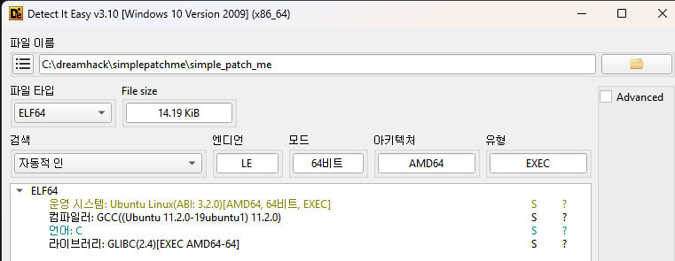
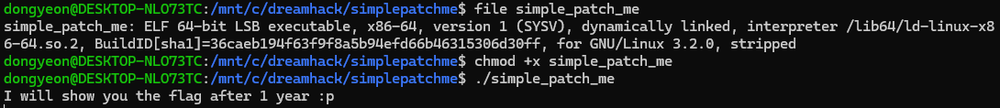
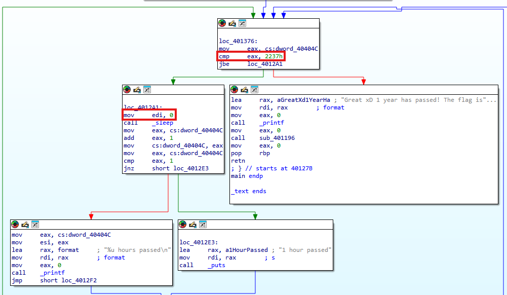

# Dreamhack: Simple Patch Me Write-up

## 1. Problem Overview
- **Category:** Reversing
- **Difficulty:** Level 1
- **Tool:** IDA Free, Ubuntu 24.04.1 LTS, DIE
- **Description:** 실제 시간으로 1년(365일)이 지나야 플래그를 출력하는 프로그램을 분석하여 우회하는 문제

## 2. Static Analysis (정적 분석)
### 2.1. Initial Analysis
제공된 simple_patch_me 파일에 확장자가 없어 파일 형식을 식별하기 위해 정적 분석 도구인 **DiE (Detect It Easy)** 를 사용했습니다. 
분석 결과, 해당 파일이 리눅스 실행 파일(ELF 64-bit)임을 확인했습니다.

Reference: DiE는 실행 파일의 컴파일러, 패커, 파일 형식 등을 상세히 알려주는 도구입니다.

이후 Ubuntu 환경에서 file 명령어를 사용하여 파일 형식을 교차 검증했습니다. 실행 권한이 없는 상태였으므로 chmod +x 명령어로 권한을 부여한 뒤 프로그램을 실행하여 동작을 확인했습니다.

### 2.2. Main Logic Finding & Solution
**Great xD 1 year has passed! The flag is ...** 라는 성공 문자열을 Cross Reference (Xref) 하여 메인 로직이 위치한 함수를 찾았습니다.

핵심 로직은 다음과 같습니다
- 루프 조건 (cmp eax, 2237h): 0x2237은 10진수로 8759입니다. 0부터 시작하므로 총 8760회 반복합니다. 이는 365일 × 24시간 = 8760시간과 일치하며, 1년 치 시간을 카운트하는 루프임을 알 수 있습니다.
- 지연 함수 (call _sleep): 루프 내부에서 sleep 함수를 호출하며, 인자로 0xE10(10진수 3600초 = 1시간)을 전달하여 시간을 지연시키고 있었습니다.

[Patch Strategy: mov edi, 0xE10 → mov edi, 0]

처음에는 루프 자체를 우회하려 했으나, 루프 내부에서 플래그 생성을 위한 연산이 수행됨을 파악했습니다. 따라서 연산은 수행하되 대기 시간만 없애기 위해 sleep 함수의 인자(edi)를 0으로 패치했습니다.
결과적으로 프로그램은 8760번의 연산을 모두 수행하면서도, 대기 시간 없이 즉시 완료되어 플래그를 출력하게 되었습니다.

## 3. Result
플래그 추출 성공: `DH{6ad0f80a0448aee5e8615fbdea9c2775}`

## 4. Thoughts
처음에는 확장자가 없는 파일을 보고 당황했지만, DiE를 활용해 리눅스 바이너리임을 식별하며 분석을 시작할 수 있었다. 
초기에는 분기문자체를 수정하여 루프를 건너뛰려 했으나, 플래그가 정상적으로 복호화되지 않는 시행착오를 겪었다. 
이를 통해 단순히 흐름을 강제로 우회하는 것이 아니라, **"연산 과정은 유지하되 불필요한 지연 시간(sleep)만 제거해야 한다"** 는 점을 깨달았다.
이번 문제를 통해 리버싱에서 무조건적인 분기문 패치는 하면안되고, 프로그램의 전체적인 로직를 정확히 파악하는 것이 중요하다는 것을 배웠다.

