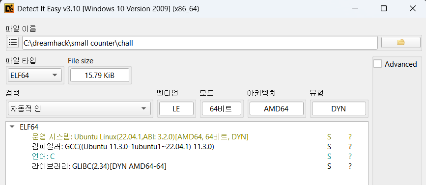
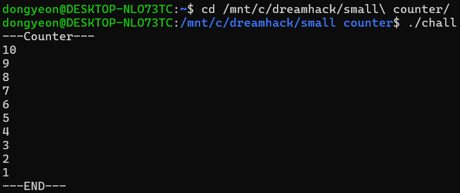
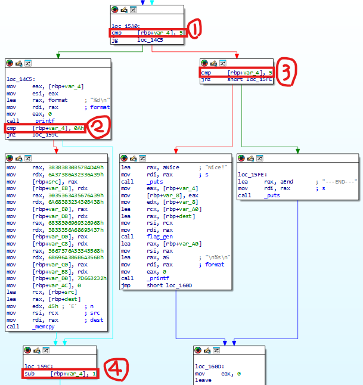
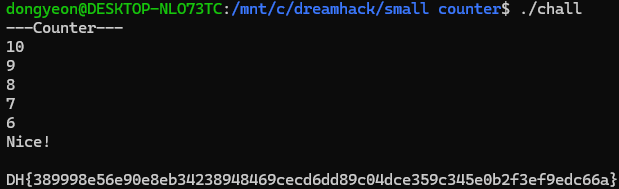

# Dreamhack: Small Counter Write-up

## 1. Problem Overview
- **Category:** Reversing
- **Difficulty:** Level 1
- **Tool:** IDA Free, Ubuntu 24.04.1 LTS, DIE
- **Description:** 프로그램 내부의 카운트 검증 로직을 분석하고, 바이너리 패치를 통해 flag_gen() 함수가 실행되도록 유도하여 플래그 획득하는 문제

## 2. Static Analysis (정적 분석)
### 2.1. Initial Analysis
제공된 Small Counter 파일에 확장자가 없어 파일 형식을 식별하기 위해 정적 분석 도구인 **DiE (Detect It Easy)** 를 사용했습니다. 
분석 결과, 해당 파일이 리눅스 실행 파일(ELF 64-bit)임을 확인했습니다.

Reference: DiE는 실행 파일의 컴파일러, 패커, 파일 형식 등을 상세히 알려주는 도구입니다.

이후 Ubuntu 환경에서 프로그램을 실행하여 동작을 확인했습니다.

### 2.2. Main Logic Finding & Solution
**Great xD 1 year has passed! The flag is ...** 라는 성공 문자열을 Cross Reference (Xref) 하여 메인 로직이 위치한 함수를 찾았습니다.

핵심 로직은 다음과 같습니다
프로그램은 counter(var_4)에 따라 두 가지 경로로 플래그를 생성하는 구조를 가지고 있습니다.

1 - 분기 조건 (cmp [rbp+var_4], 0) -> (cmp [rbp+var_4], 5): counter가 0보다 큰지 비교해서 값이 0보다 크면(jg) 좌측의 루프(Loop) 영역으로 진입하고, 0이하이면 우측의 단일 검사 영역으로 분기하여 플래그 획득 경로를 이원화하고 있는코드였습니다. 하지만 그렇게되면 3조건을 만족시킬 수 없기에 위와같이 패치했습니다.
2 - 루프 목표값 검증 (cmp [rbp+var_4], 3h) -> (cmp [rbp+var_4], 0Ah): 루프 진입 시 현재 값이 0x3인지 확인합니다. 값이 3과 일치할 경우 flag 출력을 위한 메모리연산을 하는것을 확인할 수 있었습니다. 하지만 1을 패치했기에 5 초과의 수만 좌측분기로 들어오기때문에 0A(10)으로 값을 패치했습니다.
3 - 즉시 성공 조건 (cmp [rbp+var_4], 5): 우측 분기(0 이하인 경우)에서는 값이 정확히 5인지 재확인합니다. 이 조건이 만족될 경우, 복잡한 반복 연산 없이 즉시 "Nice!" 문자열을 출력하고 flag_gen 함수를 호출하여 빠르게 플래그를 획득할 수 있습니다.
4 - 카운트 다운 (sub [rbp+var_4], 1): counter에서 1을 차감(sub)하고 다시 상단의 분기점으로 돌아갑니다. 이 구문은 입력값이 0에 도달할 때까지 숫자를 하나씩 줄여나가는 카운트다운 역할을 수행합니다.

[Patch Strategy: mov edi, 0xE10 → mov edi, 0]

처음에는 루프 자체를 우회하려 했으나, 루프 내부에서 플래그 생성을 위한 연산이 수행됨을 파악했습니다. 따라서 연산은 수행하되 대기 시간만 없애기 위해 sleep 함수의 인자(edi)를 0으로 패치했습니다.
결과적으로 프로그램은 8760번의 연산을 모두 수행하면서도, 대기 시간 없이 즉시 완료되어 플래그를 출력하게 되었습니다.

## 3. Result
플래그 추출 성공: `DH{6ad0f80a0448aee5e8615fbdea9c2775}`

## 4. Thoughts
처음에는 확장자가 없는 파일을 보고 당황했지만, DiE를 활용해 리눅스 바이너리임을 식별하며 분석을 시작할 수 있었다. 
초기에는 분기문자체를 수정하여 루프를 건너뛰려 했으나, 플래그가 정상적으로 복호화되지 않는 시행착오를 겪었다. 
이를 통해 단순히 흐름을 강제로 우회하는 것이 아니라, **연산 과정은 유지하되 불필요한 지연 시간(sleep)만 제거해야 한다** 는 점을 깨달았다.
이번 문제를 통해 리버싱에서 무조건적인 분기문 패치는 하면안되고, 프로그램의 전체적인 로직를 정확히 파악하는 것이 중요하다는 것을 배웠다.

