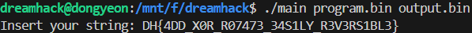

# Dreamhack: ezmix Write-up

## 1. Problem Overview
- **Category:** Reversing
- **Difficulty:** Level 2
- **Tool:** IDA Free, VS Code (Python), pwndbg
- **Description:** 사용자 입력값을 특정 규칙에 따라 변형하여 output.bin을 생성하는 바이너리를 분석하여 복호화 하는 문제

## 2. Static Analysis (정적 분석)
### 2.1. Main Logic Finding 

```C
  for ( i = 0; ; i += 2 )
  {
    result = i;
    if ( (int)i >= a2 )
      break;
    v6 = *(_BYTE *)((int)i + 1LL + a1);
    v3 = *(unsigned __int8 *)((int)i + a1);
    if ( v3 == 4 )
    {
      printf("Insert your string: ");
      fgets(a3, 256, stdin);
      a3[strcspn(a3, "\n")] = 0;
      v7 = strlen(a3);
    }
    else
    {
      if ( *(unsigned __int8 *)((int)i + a1) > 4u )
        goto LABEL_12;
      switch ( v3 )
      {
        case 3:
          sub_1301(sub_12C2, v6, a3, v7);
          break;
        case 1:
          sub_1301(sub_1289, v6, a3, v7);
          break;
        case 2:
          sub_1301(sub_12A7, v6, a3, v7);
          break;
        default:
LABEL_12:
          puts("Error!");
          exit(1);
      }
    }
  }
  return result;
```

**buf**배열에 문자열을 입력받아 세 함수(sub_1209,sub_125C,sub_13E7)를 실행하며 memcmp를 통해서 문자열을 비교하고있습니다.

linux 동적 디버거 pwndbg로 v6값 즉 **[rbp - 0x210]** 에 위치하는값을 확인해보았습니다. 

## 3. Dynamic Analysis (동적 분석)
### 3.1. MD5 constant value finding 
**sub_1209** 실행 후 MD5의 표준 초기값 4개를 **[rbp - 0x210]** 에 저장하는것을 확인했습니다.

x64 아키텍처는 데이터를 메모리에 저장할 때 리틀엔디언으로 저장합니다.

```bash
pwndbg> x/88bx $rbp - 0x210
0x7fffffffda90: 0x00    0x00    0x00    0x00    0x00    0x00    0x00    0x00
0x7fffffffda98: 0x01    0x23    0x45    0x67    0x89    0xab    0xcd    0xef
0x7fffffffdaa0: 0xfe    0xdc    0xba    0x98    0x76    0x54    0x32    0x10
```

> - A: `0x67452301`
> - B: `0xEFCDAB89`
> - C: `0x98BADCFE`
> - D: `0x10325476`

이를 통해 변조되지 않은 **Standard MD5** 알고리즘임을 확인했습니다.

### 3.2. Input value finding
**sub_125C** 실행 후 입력했던 문자열 **testtest** 중 **tes**까지 **[rbp - 0x210]** 에 저장하는것을 확인했습니다.

```bash
pwndbg> x/88bx $rbp - 0x210
0x7fffffffda90: 0x18    0x00    0x00    0x00    0x00    0x00    0x00    0x00
0x7fffffffda98: 0x01    0x23    0x45    0x67    0x89    0xab    0xcd    0xef
0x7fffffffdaa0: 0xfe    0xdc    0xba    0x98    0x76    0x54    0x32    0x10
0x7fffffffdaa8: 0x74    0x65    0x73

**문자열 tes를 각각 ascii hex값으로 변환하면 0x74, 0x65, 0x73이다.
```

### 3.3. MD5 & memcmp
**sub_13E7** 실행 후 MD5의 표준 초기값 4개가 각각 알수없는 숫자로 바뀌어 있는것을 확인했습니다.

```bash
pwndbg> x/88bx $rbp - 0x210
0x7fffffffda90: 0xc0    0x01    0x00    0x00    0x00    0x00    0x00    0x00  
0x7fffffffda98: 0x28    0xb6    0x62    0xd8    0x83    0xb6    0xd7    0x6f
0x7fffffffdaa0: 0xd9    0x6e    0x4d    0xdc    0x5e    0x9b    0xa7    0x80
0x7fffffffdaa8: 0x74    0x65    0x73
```

직접 tes 문자열을 md5해보니 $rbp - 0x210에 저장된 값과 동일했습니다.
```python
import hashlib

buf="tes"
print(hashlib.md5(buf.encode('utf-8')).hexdigest())

result:28b662d883b6d76fd96e4ddc5e9ba780
```

**memcmp**의 인수 **rdi**, **rsi**값을 확인했습니다.
```bash
pwndbg> x/2gx $rdi
0x7fffffffdae8: 0x6fd7b683d862b628      0x80a79b5edc4d6ed9 #메모리에 little-endian으로 저장되어있었으니 꺼낼때는 반대로

pwndbg> x/2gx $rsi
0x7fffffffdb00: 0xfe5d3a093968d02b      0xba0aa367c2862eae
```

**[Encoding result]**: input을 세글자씩 md5한값과 part[i*2],part[i*2+1]을 합친값을 비교하고있습니다.
```python
for i in range(9):
    part1=part[i*2]
    part2=part[i*2+1]
    cmp_str=part1+part2
    memcmp(MD5(input[3*i:3*i+2]),cmp_str)
```

## 4. Solution
- memcmp 함수가 호출되는 시점의 두 번째 인자($rsi)에서 비교 대상이 되는 해시 데이터를 추출했습니다.
- 메모리에서 추출한 값은 **리틀 엔디언(Little Endian)** 으로 저장되어 있으므로, Python의 struct 모듈을 사용하여 이를 정상적인 바이트 배열로 복원했습니다.
- 복원한 해시값과 일치하는 원본 문자열을 찾기 위해, hashlib과 itertools를 사용하여 가능한 모든 문자열 조합을 brute-force 공격했습니다.

### Full Solver Code
[solution](./solution.py) 파일을 참고하세요.

## 4. Result
플래그 추출 성공: DH{4DD_X0R_R07473_34S1LY_R3V3RS1BL3}



## 5. Thoughts


