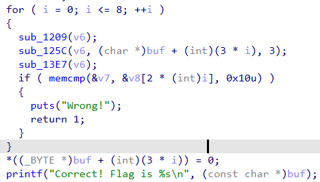
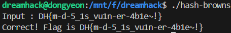

# Dreamhack: hash-browns Write-up

## 1. Problem Overview
- **Category:** Reversing
- **Difficulty:** Level 3
- **Tool:** IDA Free, VS Code (Python), pwndbg
- **Description:** 주어진 md5 해쉬값을 활용하여 correct를 출력하는 문자열을 복호화 하는 문제
- 
### MD5 개념 (Reference)
- MD5(Message-Digest Algorithm 5)는 128-bit(16byte) 고정 길이의 해시값을 출력하는 단방향 암호화 알고리즘입니다.

## 2. Static Analysis (정적 분석)
### 2.1. Main Logic Finding 



**buf**배열에 문자열을 입력받아 세 함수를 실행하며 memcmp를 통해서 문자열을 비교하고있습니다.

linux 동적 디버거 pwndbg로 v6값 즉 **[rbp - 0x210]에 위치하는값을 확인해보았습니다. 


바이너리 분석 중 MD5의 표준 초기값 4개를 메모리에 저장하는것을 확인했습니다.

```bash
pwndbg> x/88bx $rbp - 0x210
0x7fffffffda90: 0x00    0x00    0x00    0x00    0x00    0x00    0x00    0x00
0x7fffffffda98: 0x01    0x23    0x45    0x67    0x89    0xab    0xcd    0xef
0x7fffffffdaa0: 0xfe    0xdc    0xba    0x98    0x76    0x54    0x32    0x10
```

이를 통해 변조되지 않은 **Standard MD5** 알고리즘임을 식별했습니다.

> - A: `0x67452301`
> - B: `0xEFCDAB89`
> - C: `0x98BADCFE`
> - D: `0x10325476`

**리틀 엔디언 (Little Endian)** 

x64 아키텍처는 데이터를 메모리에 저장할 때 바이트 순서를 거꾸로 저장합니다. GDB 분석 시 이 점을 유의해야 합니다.

```bash
pwndbg> x/88bx $rbp - 0x210
0x7fffffffda90: 0x00    0x00    0x00    0x00    0x00    0x00    0x00    0x00
0x7fffffffda98: 0x01    0x23    0x45    0x67    0x89    0xab    0xcd    0xef
0x7fffffffdaa0: 0xfe    0xdc    0xba    0x98    0x76    0x54    0x32    0x10
```

Usage 문자열: 프로그램 실행 시 첫 번째 인자로 **table filename** 을 요구

데이터 로드: fread 함수를 통해 해당 파일에서 65바이트를 읽어 전역 변수 **byte_4040** 에 저장

결론: **table** 파일의 data가 **byte_4040**에 저장

### 2.2. Assembly to Python (핵심)
- C언어로 작성된 sub_1289 함수의 핵심 비트 연산 로직을 Python으로 재구성하면 다음과 같음

**[Reconstructed Python Code]**
```python
# 입력 3바이트 -> 출력 4바이트 변환 로직
# C언어의 포인터 연산을 배열 인덱싱으로 변환

idx1 = in_chunk[0] >> 2
idx2 = ((in_chunk[1] >> 4) | (16 * in_chunk[0]) & 0x30)
idx3 = ((in_chunk[2] >> 6) | (4 * in_chunk[1]) & 0x3C)
idx4 = in_chunk[2] & 0x3F

# 위 인덱스를 이용해 table에서 값을 가져옴
out[0] = table[idx1]
out[1] = table[idx2]
out[2] = table[idx3]
out[3] = table[idx4]
```

## 3. Solution
### 3.1. Recovering Table
text_in.txt과 text_out.txt를 활용하여 테이블 byte_4040을 복구한

- 핵심 아이디어: 인코딩 식을 역으로 이용하여, table[계산된_인덱스] = 암호문_문자 형태로 매핑

- 주의점: 파일의 줄바꿈(\n)이나 패딩(=) 문자는 인덱스 계산을 어긋나게 하므로 전처리 과정에서 제거

[make_table](./make_table.py) 파일을 참고하세요.

### 3.2. Decode Flag (Bitwise Operation)
복구된 테이블을 역참조(index())하고 비트연산을 통해 6bit x 4를 8bit x 3으로 만들어야함

[Key Point: C vs Python] 
- Python은 정수형의 크기 제한이 없으므로, 왼쪽 시프트(<<) 연산 시 상위 비트가 잘려나가지 않고 값이 계속 커짐
  
- 따라서 반드시 & 0xFF 등의 마스킹을 통해 불필요한 비트를 제거해줘야 함
  
**[Important Decoding Code]**
```python
# val1~4는 테이블에서의 인덱스 값 (0~63)

# val1의 6비트 + val2의 상위 2비트
b1 = (val1 << 2) | (val2 >> 4)

# val2의 하위 4비트 + val3의 상위 4비트
# val2 & 0x0F를 하지 않으면 앞쪽 비트 값이 남아서 값이 커짐
b2 = ((val2 & 0x0F) << 4) | (val3 >> 2)

# val3의 하위 2비트 + val4의 6비트
b3 = ((val3 & 0x03) << 6) | val4
```

### Full Solver Code
[solution](./solution.py) 파일을 참고하세요.

## 4. Result
플래그 추출 성공: DH{Did you know how base64 works}



## 5. Thoughts
두번째 레벨 3 문제를 풀었다. table 복구는 생각보다 수월했지만 가장 기본적인 파이썬에서의 정수형을 생각하지않고 계산해서 
복호화 과정에서 오래걸렸다. 레벨이 올라오면서 기술이 필요하다기보다는 누가 기본이 가장 잘 되어있는지를 보는것같다.
항상 기초부터 차근차근 생각해야겠다.


