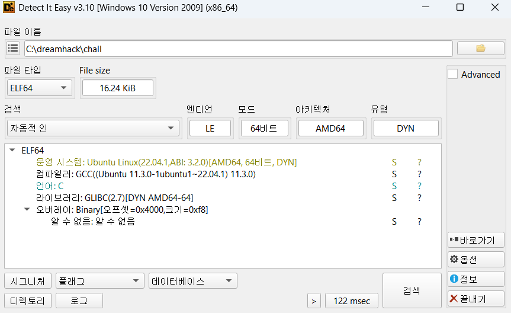
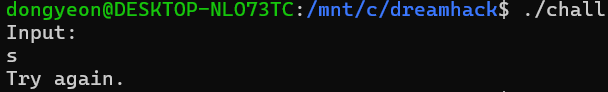
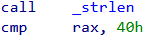
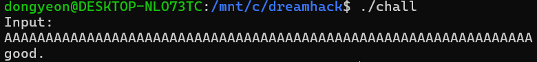
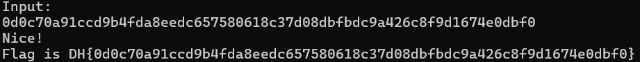

# Dreamhack: mix-compare Write-up

## 1. Problem Overview
- **Category:** Reversing
- **Difficulty:** Level 2
- **Tool:** IDA Free, Pwndbg, DIE
- **Description:** 사용자에게 입력값을 받아 검증하고 flag를 출력하는 문제

## 2. Static Analysis (정적 분석)
### 2.1. Initial Analysis
제공된 chall 파일에 확장자가 없어 파일 형식을 식별하기 위해 정적 분석 도구인 DIE (Detect It Easy) 를 사용했습니다. 분석 결과, 해당 파일이 리눅스 실행 파일(ELF 64-bit)임을 확인했습니다.

Reference: DIE는 실행 파일의 컴파일러, 패커, 파일 형식 등을 상세히 알려주는 도구입니다.

이후 리눅스 환경에서 Pwndbg툴을 사용해 프로그램을 실행하여 동작을 확인했습니다.

아무 문자열이을 입력했더니 **Try again**이 출력되는것을 확인했습니다. 

Reference: Pwndbg는 리눅스 GDB(GNU Debugger)를 위한 플러그인으로 바이너리의 실행 흐름을 추적할 때 
레지스터, 메모리, 스택, 디스어셈블리 코드를 한 화면(Context View)에 직관적으로 시각화해 주는 강력한 동적 분석 도구입니다.

### 2.2 Main Logic Finding & Solution
**chall**문제 파일을 ida로 열어 어셈블리 구조를 확인했습니다.

**check**함수를 통해 input을 검증하고 flag를 출력할지를 결정하고있습니다.

**input**문자열이 64글자라는것을 비교구문을 통해서 확인했습니다.

**input**문자열을 64글자로 세팅 후 입력해보니 위와는 다른결과인
**good**이 출력되었습니다.

패치 후 실행해보니 입력값을 받아서 DH{}를 출력하는것을 확인할 수 있었습니다.

올바른 입력값이 들어간다면 프로그램이 flag를 제대로 출력할것이고,
프로그램 안에 어떤 입력값이 들어가야하는지를 특정숫자와 비교하는구문이 있을것이라는 가설을 세웠습니다.

**ecx**와 **eax**레지스터에 있는값을 비교해서 get_flag를 출력할지말지를 결정하는 부분입니다.

**ecx**와 **eax**에 어떤값이 들어가는지 실제로 확인하기 위해서 pwndbg로 디버깅해보았습니다.
입력값으로 넣은 수 0x263(10진수 611)과 5를 비교하는것을 확인했습니다.

5를 넣으면 get_flag()가 호출될것이라고 생각하고 입력값으로 5를 넣고 실행해보았습니다.
68자리는 아니지만 정상적인 문자로 구성된 32글자의 flag가 출력되었습니다.

get_flag()를 호출할지 말지를 결정하는 비교구문을 확인했습니다.

실제로 레지스터 값들을 확인하기위해 해당 부분을 디버깅해보았습니다.
입력값을 3과 비교하는것을 확인했습니다.

3을 입력값으로 넣어서 실행했지만 텅빈 flag가 나왔습니다.
이런경우는 출제자가 의도적으로 코드를 꼬아놓거나 특정조건에서 출력될 가능성이 높습니다.

입력값이 3일 때 호출되는 get_flag() 루틴을 분석한 결과 
반환값을 저장하는 인덱스 연산에 오류가 있음을 확인했습니다.

원래는 인덱스 0부터 저장되어야 하나 코드상에서 result[i + 0x1C]와 같이 오프셋(0x1C, 10진수 28)이 더해지고 있었습니다.

이로 인해 플래그가 버퍼의 28번째 인덱스부터 기록되었으며 앞부분이 비어있어 출력 시 플래그가 보이지 않았던 것입니다.

오프셋(0x1C)를 더하는 부분을 nop처리 해주었습니다.

다시 3을 넣어서 출력해주니 정상적인 flag가 출력되는것을 확인할 수 있었습니다.
앞서 5를 넣었을때 출력된 flag와 합쳐보니 68글자로 문제에서 제공되었던 정보와 같은걸로 보아
합한것이 최종 flag라고 결론을 내렸습니다.

## 3. Result
DH{c8b48ac08bbe00068ffb6606e2cf6ba0002c0dc4dd0aba20ac8d0608860048e0}

## 4. Thoughts
처음으로 어셈블리어를 분석하지않고 동적분석도구를 적극활용하여 문제를 풀었다.
먼저 ida로 초기분석을 하고 확인하고 싶은 부분을 pwndbg로 실시간으로 값을 확인하니 직접 눈빠지게 어셈블리어를 분석하는것보다 시간도 덜 걸렸고
새로운 tool을 다룰수 있게되어서 좋았다.

