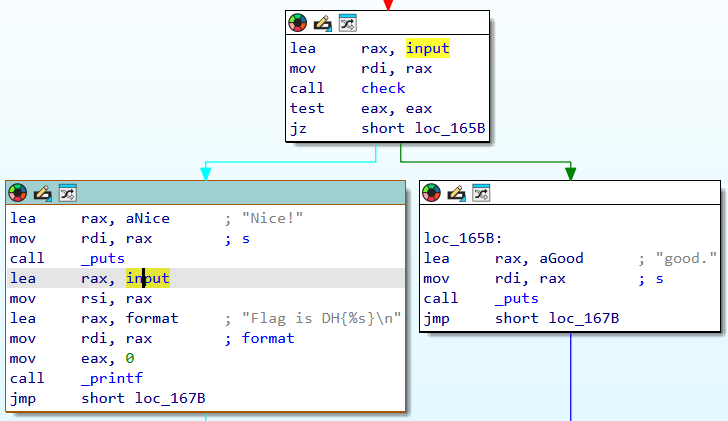
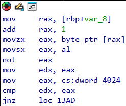
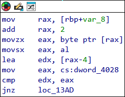
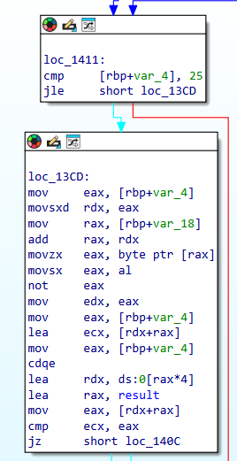
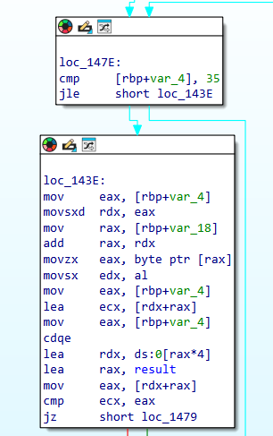
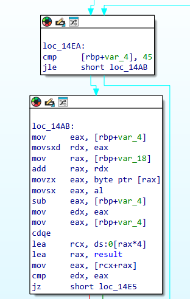
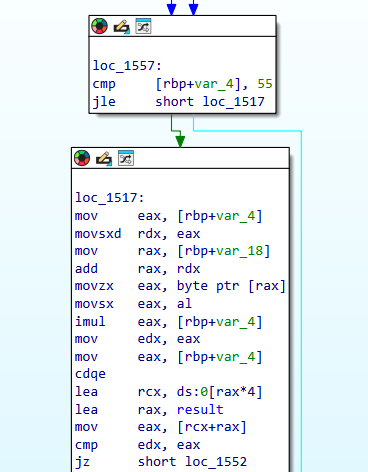
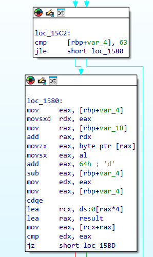

# Dreamhack: mix-compare Write-up

## 1. Problem Overview
- **Category:** Reversing
- **Difficulty:** Level 2
- **Tool:** IDA Free, Pwndbg, DIE
- **Description:** 사용자에게 입력값을 받아 검증하고 flag를 출력하는 문제

## 2. Static Analysis (정적 분석)
### 2.1. Initial Analysis
제공된 chall 파일에 확장자가 없어 파일 형식을 식별하기 위해 정적 분석 도구인 DIE (Detect It Easy) 를 사용했습니다. 분석 결과, 해당 파일이 리눅스 실행 파일(ELF 64-bit)임을 확인했습니다.

Reference: DIE는 실행 파일의 컴파일러, 패커, 파일 형식 등을 상세히 알려주는 도구입니다.

이후 리눅스 환경에서 Pwndbg툴을 사용해 프로그램을 실행하여 동작을 확인했습니다.

아무 문자열이을 입력했더니 **Try again**이 출력되는것을 확인했습니다. 

Reference: Pwndbg는 리눅스 GDB(GNU Debugger)를 위한 플러그인으로 바이너리의 실행 흐름을 추적할 때 
레지스터, 메모리, 스택, 디스어셈블리 코드를 한 화면(Context View)에 직관적으로 시각화해 주는 강력한 동적 분석 도구입니다.

### 2.2 Main Logic Finding & Solution
**chall**문제 파일을 ida로 열어 어셈블리 구조를 확인했습니다.

**check**함수를 통해 input을 검증하고 flag를 출력할지를 결정하고있습니다.

**input**문자열이 64글자라는것을 비교구문을 통해서 확인했습니다.

**input**문자열을 64글자로 세팅 후 입력해보니 위와는 다른결과인
**good**이 출력되었습니다.

핵심 로직이라 생각되는 **check** 함수를 분석해보았습니다.
아래 그림을 해석하면 **~(input[1]) == dword_4024**를 실행한것과 같습니다.
아래와 같은형식의 어셈블리구문이 16번 반복되는것을 확인했습니다.

이해를 돕기 위해 i==2일때도 해석해보겠습니다.
**input[2]-4 == dword_4028**입니다.

16번 모두 다른연산이지만 더하기 빼기와 같은 복호화가 쉬운 연산이어서
쉽게 복구할 수 있었습니다.

16번의 연산 후 **check_not**함수가 호출됩니다.

**check_not**함수는 i==16 ~ i==25까지 loop를 돌며
**~input[i] + i == result[4*i]** 를 실행하고있습니다.

**check_not**함수의 복호화 로직은 **input[i] == ~(result[4*i] - i)** 입니다.
10번의 연산 후 **check_add**함수가 호출됩니다.

**check_add**함수는 i==26 ~ i==35까지 loop를 돌며
**input[i] + i == result[4*i]** 를 실행하고있습니다.

**check_add**함수의 복호화 로직은 **input[i] == result[4*i] - i**입니다.
10번의 연산 후 **check_dec**함수가 호출됩니다.

**check_dec**함수는 i==36 ~ i==45까지 loop를 돌며
**input[i] - i == result[4*i]** 를 실행하고있습니다.

**check_dec**함수의 복호화 로직은 **input[i] == result[4*i] + i**입니다.
10번의 연산 후 **check_mul**함수가 호출됩니다.

**check_mul**함수는 i==46 ~ i==55까지 loop를 돌며
**input[i] * i == result[4*i]** 를 실행하고있습니다.

**check_mul**함수의 복호화 로직은 **input[i] == result[4*i] / i**입니다.
10번의 연산 후 **check_la**함수가 호출됩니다.

**check_la**함수는 i==56 ~ i==63까지 loop를 돌며
**input[i] + 0x64 - i  == result[4*i]** 를 실행하고있습니다.

**check_la**함수의 복호화 로직은 **input[i] == result[4*i] + i - 0x64**입니다.

복호화 수도코드들을 바탕으로 solver코드를 짰습니다.

[solution.c](./solver.py)

## 3. Result

## 4. Thoughts
질리도록 풀었던 역연산 복호화문제였다. 다른문제들과의 차이점은 compare하는 비교구간이 너무 다양했고
초반의 16글자를 전부 직접 구해야하는게 빡셌다. 로직이 어려웠다기보다는 할게 너무 많았다.
이제 어셈블리어가 문제를 푸는데 있어서 방해되지않는다. pwndbg를 같이 활용하니 시간이 훨 줄었다.
ida로 정적분석 후 pwndbg로 실제로 맞는지 확인하는식이니 중간에 틀려서 다시 돌아가는일이 없다.

