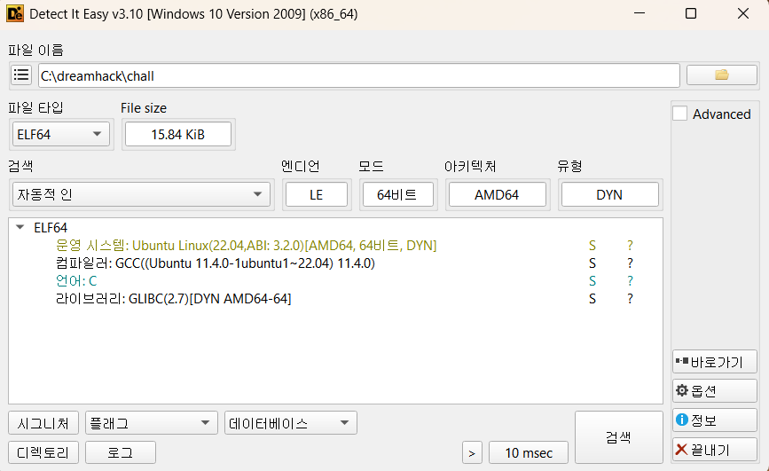
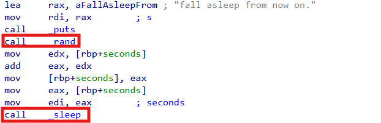
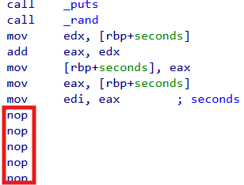
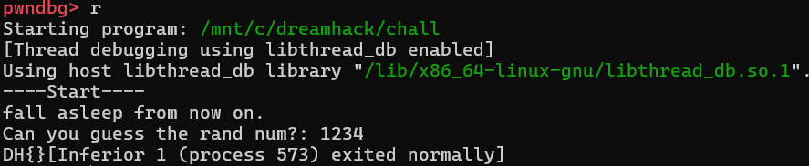
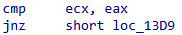
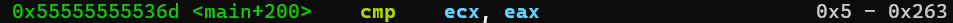
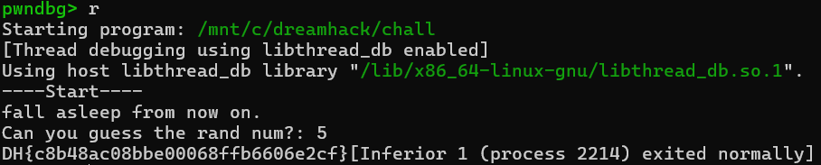
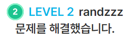

# Dreamhack: randzzz Write-up

## 1. Problem Overview
- **Category:** Reversing
- **Difficulty:** Level 2
- **Tool:** IDA Free, Pwndbg, DIE
- **Description:** 랜덤한 값을 맞추어 get_flag()함수를 호출하는 문제

## 2. Static Analysis (정적 분석)
### 2.1. Initial Analysis
제공된 chall 파일에 확장자가 없어 파일 형식을 식별하기 위해 정적 분석 도구인 DIE (Detect It Easy) 를 사용했습니다. 분석 결과, 해당 파일이 리눅스 실행 파일(ELF 64-bit)임을 확인했습니다.

Reference: DIE는 실행 파일의 컴파일러, 패커, 파일 형식 등을 상세히 알려주는 도구입니다.

이후 리눅스 환경에서 Pwndbg툴을 사용해 프로그램을 실행하여 동작을 확인했습니다.

**fall asleep from now on**문자열이 출력된 이후에 프로그램이 멈추는것을 확인했습니다.

프로그램을 멈추게 하는 **sleep**과 같은 함수가 있을것이라고 생각했습니다.

Reference: Pwndbg는 리눅스 GDB(GNU Debugger)를 위한 플러그인으로 바이너리의 실행 흐름을 추적할 때 
레지스터, 메모리, 스택, 디스어셈블리 코드를 한 화면(Context View)에 직관적으로 시각화해 주는 강력한 동적 분석 도구입니다.

### 2.2 Main Logic Finding
**chall**문제 파일을 ida로 열어 어셈블리 구조를 확인했습니다.
**fall asleep from now on** 문자열을 출력하는 구문 뒤에 난수를 **rand**함수로 입력받아서
**_sleep**함수의 인자로 넣어주는것을 볼 수 있습니다.

**_sleep** 함수는 5byte 크기의 함수이므로 1byte크기의 nop으로 다섯번 대체해주었습니다.

패치 후 실행해보니 입력값을 받아서 DH{}를 출력하는것을 확인할 수 있었습니다.

올바른 입력값이 들어간다면 프로그램이 flag를 제대로 출력할것이고,
프로그램 안에 어떤 입력값이 들어가야하는지를 특정숫자와 비교하는구문이 있을것이라는 가설을 세웠습니다.

**ecx**와 **eax**레지스터에 있는값을 비교해서 get_flag를 출력할지말지를 결정하는 부분입니다.

**ecx**와 **eax**에 어떤값이 들어가는지 실제로 확인하기 위해서 pwndbg로 디버깅해보았습니다.
입력값으로 넣은 수 0x263(10진수 611)과 5를 비교하는것을 확인했습니다.

5를 넣으면 get_flag()가 호출될것이라고 생각하고 입력값으로 5를 넣고 실행해보았습니다.
68자리는 아니지만 정상적인 문자로 구성된 32글자의 flag가 출력되었습니다.

## 3. Solution (풀이 과정)
위 다이어그램을 바탕으로 solvercode를 짰습니다.

flag.txt를 복구하는 파이썬 코드는 다음과 같습니다.

### Full Solver Code
[solution](./solution.py) 파일을 참고하세요.

## 4. Result

## 5. Thoughts
처음에는 주요 로직을 분석했을때 그냥 다른 암호화문제들이랑 다를게 없어서 쉽다생각했는데, modulo연산과 지수계산이 섞인 연산을 역연산하려니까 
못 풀겠어서 구글링을 했더니 RSA 암호화 알고리즘이라는것을 알게되었고 **소인수분해**와 inverse계산을 통해서 privatekey를 찾는것이 핵심이었다.
암호학의 기초인 RSA알고리즘을 알게되었는데 진짜 쉽지않았다.

