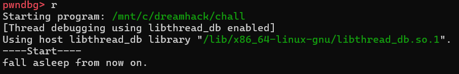
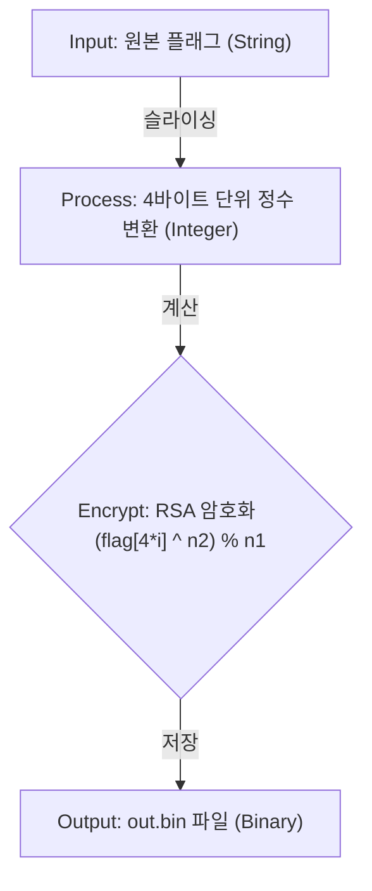
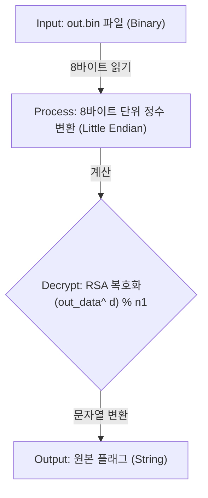

# Dreamhack: randzzz Write-up

## 1. Problem Overview
- **Category:** Reversing
- **Difficulty:** Level 2
- **Tool:** IDA Free, Pwndbg, DIE
- **Description:** 랜덤한 값을 맞추어 get_flag()함수를 호출하는 문제

## 2. Static Analysis (정적 분석)
### 2.1. Initial Analysis
제공된 chall 파일에 확장자가 없어 파일 형식을 식별하기 위해 정적 분석 도구인 DIE (Detect It Easy) 를 사용했습니다. 분석 결과, 해당 파일이 리눅스 실행 파일(ELF 64-bit)임을 확인했습니다.

Reference: DIE는 실행 파일의 컴파일러, 패커, 파일 형식 등을 상세히 알려주는 도구입니다.


이후 리눅스 환경에서 Pwndbg툴을 사용해 프로그램을 실행하여 동작을 확인했습니다.

**fall asleep from now on**문자열이 출력된 이후에 프로그램이 멈추는것을 확인했습니다.

프로그램을 멈추게 하는 **sleep**과 같은 함수가 있을것이라고 생각했습니다.

Reference: Pwndbg는 리눅스 GDB(GNU Debugger)를 위한 플러그인으로 바이너리의 실행 흐름을 추적할 때 
레지스터, 메모리, 스택, 디스어셈블리 코드를 한 화면(Context View)에 직관적으로 시각화해 주는 강력한 동적 분석 도구입니다.




### 2.2 Main Logic Finding
**chall**문제 파일을 ida로 열어 어셈블리 구조를 확인했습니다.
**fall asleep from now on** 문자열을 출력하는 구문 뒤에 난수를 **rand**함수로 입력받아서
**_sleep**함수의 인자로 넣어주는것을 볼 수 있습니다.


**_sleep** 함수는 5byte 크기의 함수이므로 1byte크기의 nop으로 다섯번 대체해주었습니다.


**out.bin**을 **wb**모드로 **fopen**하는것을 확인할 수 있습니다.

**flag.txt**에서 data를 받아와서 **암호화**과정을 거친다음에 **out.bin**파일에 **write**하는구나라는 가성을 세웠습니다.
내가 해야할것은 암호화함수를 코드로 재구성한 다음에 복호화 코드를 짜야겠다고 생각했습니다.


**call sub_1289**함수를 통해 나온 결과값을 **_fwrite**를 통해서 **out.bin**에 **write**하는것을 보고
**call sub_1289**이 암호화 함수라고 결론을 내렸습니다.


**flag.txt**를 구하기 위해서는 암호화함수인 **sub_1289**뿐만이 아니라 주변 어셈블리들도 분석하여
역연산함수를 만들어야합니다.

**sub_1289**의 동작을 중심으로 분석했습니다.

### **main함수의 일부분** Stack Frame & Register Setup
| Register / Memory | Variable Name (내 방식) | Description |

| `[rbp+stream]` | `out.bin addr` | out.bin file address |

| `[rbp+var_174]` | `i` | loop counter |

| `[rbp+s]` | `flag.txt addr` | flag.txt file address |

| `[rbp+140]` | `n1` | n1 |

| `[rbp+138]` | `n2` | n2 |

### Assembly Logic 
```assembly

loc_1734:
    lea     rsi, aWb                    ; "wb"
    lea     rdi, aOutBin                ; "out.bin"
    call    _fopen                                
    mov     [rbp+stream], rax			;[rbp+stream]=out.bin addr
    mov     [rbp+var_174], 0			;index=0
    jmp     short loc_17CC
loc_17CC:
    mov     eax, [rbp+var_174]			;eax=index
    movsxd  rbx, eax					;rbx=index
    lea     rax, [rbp+s]				;rax=flag.txt addr
    mov     rdi, rax            		;rdi=flag.txt addr
    call    _strlen					    ;rax=strlen(flag)
    shr     rax, 2					    ;rax=strlen(flag)>>2
    cmp     rbx, rax					;if (index < strlen(flag)>>2) jmp loc_175A 
    jb      loc_175A

loc_175A:
    mov     eax, [rbp+var_174]			;eax=index
    cdqe
    lea     rdx, ds:0[rax*4]			;rdx=index*4
    lea     rax, [rbp+s]				;rax=flag.txt addr
    add     rax, rdx					
    mov     eax, [rax]					;eax=flag[4*i]
    mov     [rbp+var_16C], eax			;[rbp+var_16C]=flag[4*i]
    mov     eax, [rbp+var_16C]			;eax=flag[4*i]
    mov     rdx, [rbp+var_140]			;rdx=n1
    mov     rcx, [rbp+var_138]			;rcx=n2
    mov     rsi, rcx					;rsi=n2				
    mov     rdi, rax					;rdi=flag[4*i]
    call    sub_1289					;sub_1289(flag[4*i],n2,n1)
    mov     [rbp+ptr], rax				;[rbp+ptr]=(flag[4*i]^n2)mod n1
    mov     rdx, [rbp+stream]           ;rdx=out.bin addr
    lea     rax, [rbp+ptr]              ;rax=[rbp+ptr] addr
    mov     rcx, rdx                    ; s            
    mov     edx, 1                      ; n
    mov     esi, 8                      ; size
    mov     rdi, rax                    ; ptr
    call    _fwrite    
    add     [rbp+var_174], 1            ;index++

```

### **sub_1289** Stack Frame & Register Setup
| Register / Memory | Variable Name (내 방식) | Description |

| `[rbp+var_28]` | `n1` | modulo value |

| `[rbp+var_20]` | `n2` | exponent value |

| `[rbp+var_18]` | `flag[4*i]` | flag.txt 4byte chunk |

| `[rbp+var_10]` | `result` | return value |

| `[rbp+var_8]` | `cnt` | loop counter |

### Assembly Logic 
```assembly

    push    rbp
    mov     rbp, rsp
    sub     rsp, 30h                    
    mov     [rbp+var_18], rdi			;[rbp+var_18]=flag[4*i]
    mov     [rbp+var_20], rsi			;[rbp+var_20]=n2
    mov     [rbp+var_28], rdx			;[rbp+var_28]=n1
    cmp     [rbp+var_28], 0				;if (n1==0) jump loc_12B2
    jnz     short loc_12B2

loc_12B2:
    mov     [rbp+var_10], 1				;result=1
    mov     [rbp+var_8], 0				;cnt=0
    jmp     short loc_12EE

loc_12EE:
    mov     rax, [rbp+var_8]			;cnt=0
    cmp     rax, [rbp+var_20]			;if (cnt<n2) jump loc_12C4
    jb      short loc_12C4
    mov     rax, [rbp+var_10]			;retrun result
    leave
    retn
; } // starts at 1289
sub_1289 endp

loc_12C4:
    mov     rax, [rbp+var_10]			;rax=result
    imul    rax, [rbp+var_18]			;rax=result*flag[4*i]
    mov     [rbp+var_10], rax			;result=result*flag[4*i]
    cmp     [rbp+var_28], 0				;n1==0
    jz      short loc_12E9
    mov     rax, [rbp+var_10]			;rax=result
    mov     edx, 0					    ;edx=0
    div     [rbp+var_28]				;rax=result/n1, rdx=result%n1	
    mov     [rbp+var_10], rdx			;result=result%n1

loc_12E9:
    add     [rbp+var_8], 1				;cnt+=1

result=(flag[4*i]^n2)%n1
```


## Encoding Logic
flag.txt를 4byte씩 잘라서 **RSA**알고리즘을 적용

out=(flag^n2)%n1 

n2는 **public key**


    

암호화 로직을 바탕으로 복호화 로직도 다이어그램으로 만들었습니다.

## Decoding Logic
RSA를 푸는 열쇠인 **d**는 **n1**을 두 소수(p, q)로 소인수분해 해야만 알 수 있는 **(p-1)(q-1)** 을 통해 만들어집니다.

d=inverse(n2,(p-1)*(q-1))

flag=(out^d)%n1

d는 **private key**



## 3. Solution (풀이 과정)
위 다이어그램을 바탕으로 solvercode를 짰습니다.

flag.txt를 복구하는 파이썬 코드는 다음과 같습니다.

### Full Solver Code
[solution](./solution.py) 파일을 참고하세요.

## 4. Result


## 5. Thoughts
처음에는 주요 로직을 분석했을때 그냥 다른 암호화문제들이랑 다를게 없어서 쉽다생각했는데, modulo연산과 지수계산이 섞인 연산을 역연산하려니까 
못 풀겠어서 구글링을 했더니 RSA 암호화 알고리즘이라는것을 알게되었고 **소인수분해**와 inverse계산을 통해서 privatekey를 찾는것이 핵심이었다.
암호학의 기초인 RSA알고리즘을 알게되었는데 진짜 쉽지않았다.


