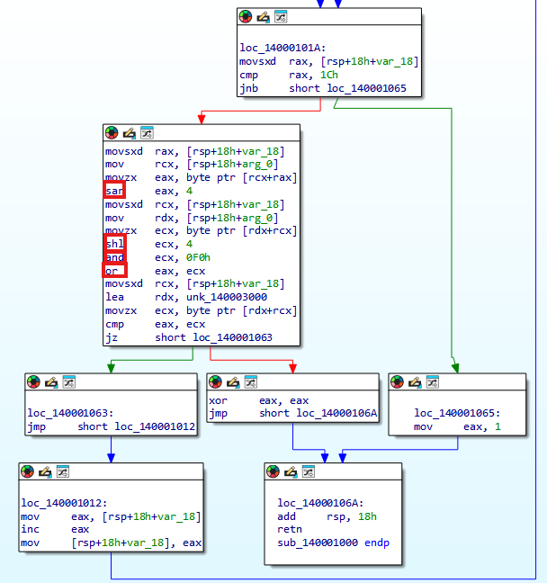
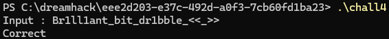

# Dreamhack: rev-basic-4 Write-up

## 1. Problem Overview
- **Category:** Reversing
- **Difficulty:** Level 1
- **Tool:** IDA Free, VS Code (C Language)
- **Description:** 사용자 입력값을 특정 알고리즘으로 변환 후 비교하는 문제. 
  단순 비교가 아닌 비트 연산이 섞인 로직을 분석해야 함.

## 2. Static Analysis (정적 분석)
### 2.1. Main Logic Finding
`Correct` 문자열을 Xref하여 메인 검증 함수(`sub_140001000`)를 찾았습니다.
함수 내부는 반복문을 돌며 사용자 입력값의 각 문자를 변환하고 있습니다.




### 2.2. Assembly to C Reconstruction (핵심)
어셈블리 코드를 분석하여 C언어로 복원했습니다.
- `shl`, `shr`, `or` 연산이 섞여 있어 처음에는 단순 시프트인 줄 알았으나, 분석 결과 **Rotate Left (ROL)** 연산임을 파악했습니다.
- C언어에는 ROL 연산자가 없으므로 시프트 연산자를 조합하여 구현했습니다.

**[Assembly Code]**
```assembly
sar     eax, 4
movsxd  rcx, [rsp+18h+var_18]
mov     rdx, [rsp+18h+arg_0]
movzx   ecx, byte ptr [rdx+rcx]
shl     ecx, 4
and     ecx, 0F0h
or      eax, ecx
```

**[Reconstructed C Code]**
```c
// 제가 복원한 변환 로직입니다.
char transform(char input) {
    // 상위 4비트와 하위 4비트의 위치를 바꾸는 로직 (4비트 Rotate)
    return (input << 4) | (input >> 4);
}
```

## 3. Solution (풀이 과정)
검증 로직이 `transform(input) == data` 형태이므로, 역연산(Inverse Operation)이 필요합니다.
하지만 이 문제의 변환 로직(Swap nibbles)은 **자기 자신이 역연산**이 되는 대칭 구조를 가지고 있습니다. (`(x << 4) | (x >> 4)`를 두 번 하면 원래대로 돌아옴).

따라서 데이터 배열을 그대로 같은 함수에 통과시켜 플래그를 추출했습니다.

### Full Solver Code
[solution.c](./solution.c) 파일을 참고하세요.

## 4. Result
플래그 추출 성공: `DH{Br1ll1ant_bit_dr1bble_<<_>>}`


