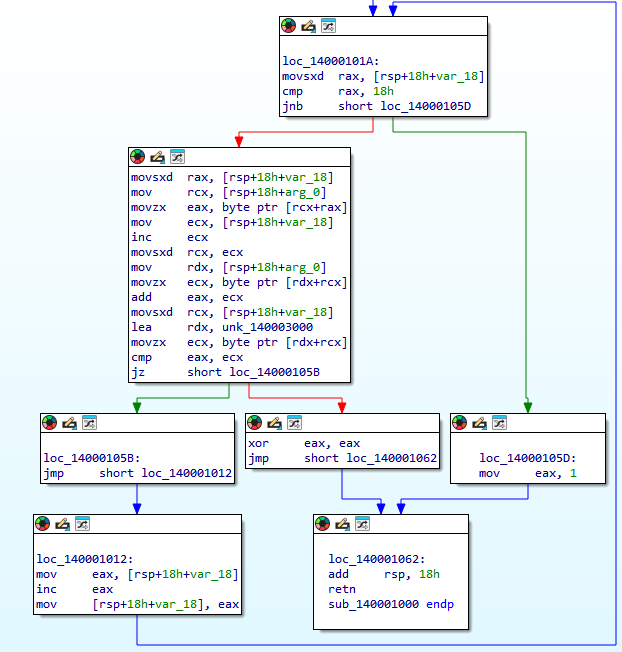
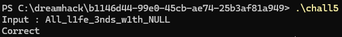

# Dreamhack: rev-basic-5 Write-up

## 1. Problem Overview
- **Category:** Reversing
- **Difficulty:** Level 2
- **Tool:** IDA Free, VS Code (C Language)
- **Description:** 사용자 입력의 연속된 두 글자 합을 검증하는 로직을 분석하고, 문자열 끝(NULL)을 기점으로 역순 계산하여 플래그를 복구함

## 2. Static Analysis (정적 분석)
### 2.1. Main Logic Finding
`Correct` 문자열을 Xref하여 메인 검증 함수(`sub_140001000`)를 찾았습니다.
함수 내부는 반복문을 돌며 사용자 입력값의 각 문자를 변환하고 연산하며 기존의 데이터와 비교하고있습니다.




### 2.2. Assembly to C Reconstruction (핵심)
어셈블리 코드를 분석하여 C언어로 복원했습니다.
- 인접한 두 문자의 합(input[i] + input[i+1])을 기존에 가지고있는 data[i]와 비교하여 검증하는 로직을 식별했습니다.
- 문자열 끝이 **NULL(0)**임을 이용해, 마지막 글자부터 역순으로 추론하는 Backward Solver를 구현하여 해결했습니다.

**[Assembly Code]**
```assembly
movsxd  rax, [rsp+18h+var_18]
mov     rcx, [rsp+18h+arg_0]
movzx   eax, byte ptr [rcx+rax]
mov     ecx, [rsp+18h+var_18]
inc     ecx
movsxd  rcx, ecx
mov     rdx, [rsp+18h+arg_0]
movzx   ecx, byte ptr [rdx+rcx]
add     eax, ecx
movsxd  rcx, [rsp+18h+var_18]
lea     rdx, unk_140003000
movzx   ecx, byte ptr [rdx+rcx]
cmp     eax, ecx
```

**[Reconstructed C Code]**
```c
/*
 * 함수: check
 * ----------------------------
 * 어셈블리 분석을 통해 재구성한 입력값 검증 로직입니다.
 * 인접한 두 문자의 합을 데이터 배열과 대조합니다.
 */
Bool check(char* input, char* data)
{
    // 총 23회 반복
    for (int i = 0; i < 23; i++)
    {
        // [검증 로직]
        // 현재 글자(input[i])와 다음 글자(input[i+1])를 더해서 비교
        // 마지막 루프(i=22)에서는 input[23]인 NULL(0)이 더해짐
        //      즉, input[22] + 0 == data[22] 가 성립함
        if ((input[i] + input[i+1]) == data[i])
        {
            continue;
        }
        else
        {
            return False; // 검증 실패
        }
    }

    return True; // 모든 조건 통과
}
```

**[분석표]**
```
Loop Index (i) :     0            1          ...         21             22 (Last)
-----------------------------------------------------------------------------------
Current Char   : [Input_0]    [Input_1]      ...     [Input_21]     [Input_22]
(Input[i])           ➕            ➕                     ➕              ➕
Next Char      : [Input_1]    [Input_2]      ...     [Input_22]     [  NULL  ] 
(Input[i+1])                                                          (0x00)
                     ⬇️            ⬇️                     ⬇️              ⬇️
Comparison     :     ==            ==                     ==              ==
Target Data    :  [Data_0]     [Data_1]      ...      [Data_21]      [Data_22]
(Hex Value)       (0xAD)       (0xD8)                 (0x98)         (0x4C)
```

## 3. Solution (풀이 과정)
**[분석표]**를 참고하면 **인접한 두 문자의 합(input[i] + input[i+1])**을 데이터 배열과 비교하는 방식인것을 알 수 있습니다. 정방향 연산으로는 값을 확정할 수 없어서 모든 C 문자열의 끝은 **NULL(0)**로 끝난다는 점에 착안하여 **역연산**을 설계했습니다.
가장 마지막 문자는 input[22] + 0 = data[22]가 성립하므로, 배열의 끝에서부터 시작하여 앞쪽으로 이동하는 역추적(Backtracking) 방식을 사용했습니다. input[i] = data[i] - input[i+1] 공식을 통해 문자열을 순차적으로 복원하여 플래그를 획득할 수 있었습니다.

### Full Solver Code
[solution.c](./solution.c) 파일을 참고하세요.

## 4. Result
플래그 추출 성공: 


