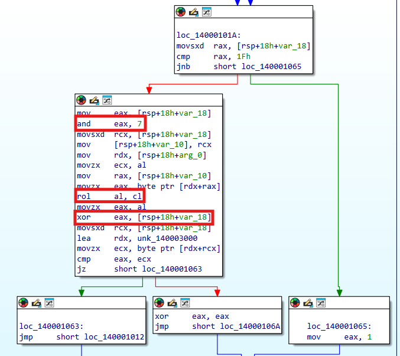
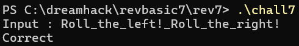

# Dreamhack: rev-basic-7 Write-up

## 1. Problem Overview
- **Category:** Reversing
- **Difficulty:** Level 2
- **Tool:** IDA Free, VS Code (C Language)
- **Description:** 사용자 입력값에 대해 비트 회전(ROL) 및 XOR 연산을 수행한 뒤, 메모리에 하드코딩된 데이터와 일치하는지 검증하는 로직을 분석하고 역연산 스크립트를 작성하는 문제

## 2. Static Analysis (정적 분석)
### 2.1. Main Logic Finding
`Correct` 문자열을 Xref하여 메인 검증 함수(`sub_140001000`)를 찾았습니다.
해당 함수를 분석한 결과, 반복문을 순회하며 아래와 같은 검증 로직을 수행하는 것을 파악했습니다.

- Rotate Count 계산: 인덱스(i)와 7을 AND 연산하여 회전 횟수를 구함.
- ROL (Rotate Left): 입력받은 문자를 위에서 구한 횟수만큼 왼쪽으로 회전.
- XOR: 회전된 결과값을 다시 인덱스(i)와 XOR 연산.
- Compare: 최종 연산 결과가 데이터 영역(data)에 저장된 값과 일치하는지 비교.




### 2.2. Assembly to C Reconstruction (핵심)
분석한 어셈블리 코드를 바탕으로 C언어 의사 코드(Pseudo-code)로 복원했습니다. 핵심 로직은 **입력 문자를 (i & 7)만큼 ROL 회전시킨 후, 인덱스(i)와 XOR 연산하여 비교**하는 과정입니다.

**[Assembly Code]**
```assembly
mov     eax, [rsp+18h+var_18]   ; i (index) 값을 가져옴
and     eax, 7                  ; i & 7 (회전 횟수 계산)
movsxd  rcx, [rsp+18h+var_18]
mov     [rsp+18h+var_10], rcx   ; (메모리 정리 과정)
mov     rdx, [rsp+18h+arg_0]    ; 입력값 배열 주소
movzx   ecx, al                 ; ecx = 회전 횟수 (i & 7)
mov     rax, [rsp+18h+var_10]
movzx   eax, byte ptr [rdx+rax] ; eax = input[i] (1바이트 로드)
rol     al, cl                  ; ROL (Rotate Left) al, cl
movzx   eax, al
xor     eax, [rsp+18h+var_18]   ; Result ^ i (XOR)
lea     rdx, unk_140003000      ; 비교할 데이터(data) 주소 로드
cmp     eax, ecx                ; 최종 비교 (Compare)
```

**[Reconstructed C Code]**
```c

#include <stdbool.h> // bool, true, false 사용을 위해

// ROL (Rotate Left) 함수 구현
// C언어에는 비트 회전 연산자가 없으므로 Shift(<<, >>)와 OR(|)를 조합해 구현
unsigned char ROL(unsigned char value, int cnt)
{
    // 8비트 자료형이므로 8번 회전하면 제자리로 돌아옴
    cnt = cnt % 8;

    /* [구현 예시] 
       값: 1000 0011 (0x83), 1비트 왼쪽 회전 시 (ROL 1)
       
       1. value << cnt      : 0000 0110 (왼쪽으로 밀고, 오른쪽은 0으로 채움)
       2. value >> (8-cnt)  : 0000 0001 (밀려난 최상위 비트가 맨 뒤로 이동)
       3. OR 연산 (|)       : 0000 0111 (두 결과를 합침 -> 회전 완료)
    */
    return (value << cnt) | (value >> (8 - cnt));
}

bool check(char* input, char* data, int len)
{
 
    for (int i = 0; i < len; i++)
    {
        // [검증 로직]
        // 1. 입력 문자(input[i])를 (i & 7)만큼 왼쪽으로 회전 (ROL)
        // 2. 그 결과를 인덱스(i)와 XOR 연산
        // 3. 미리 정의된 데이터(data[i])와 비교
        if ( (ROL(input[i], i & 7) ^ i) != data[i] )
        {
            return false; // 하나라도 다르면 검증 실패
        }
    }

    return true; // 모든 검증 통과
}
```

## 3. Solution (풀이 과정)
정적 분석을 통해 파악한 암호화 루틴은 Input -> ROL -> XOR -> Data 순서로 진행됩니다. 따라서 원본 플래그(Input)를 복구하기 위해서는 연산 순서를 역순으로 뒤집고, 각 연산의 역함수(Inverse Function)를 적용해야 합니다. ex) ROL대신 ROR적용

[역연산로직그림](./inverse_logic_flow.png)

Step 1 (XOR 복구): XOR 연산의 역연산은 자기 자신이므로, 데이터(Data)에 인덱스(i)를 다시 XOR 합니다.
Step 2 (Rotate 복구): ROL(왼쪽 회전)의 역연산은 ROR(오른쪽 회전) 이므로, Step 1의 결과를 (i & 7)만큼 오른쪽으로 회전시킵니다.

### Full Solver Code
[solution.c](./solution.c) 파일을 참고하세요.

## 4. Result
플래그 추출 성공: `DH{All_l1fe_3nds_w1th_NULL}`



## 5. 느낀점
난이도가 하나 올라갔다고 같은유형이어도 깊이가 달라진것같다. 
가장기초적인 C언어 문자열의 끝은 NULL값이라는것을 파악하는것이 오래걸렸고, 그 뒤로 역연산을 구현하는것은 할만했다. 
어렵게 생각하지말고 쉽게 생각하자 가끔은 단순함이 답일때도있다.

