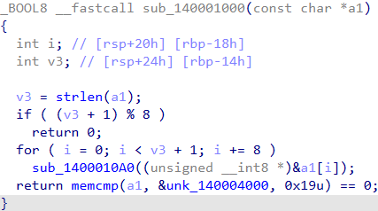
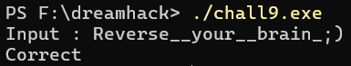

# Dreamhack: rev-basic-9 Write-up

## 1. Problem Overview
- **Category:** Reversing
- **Difficulty:** Level 3
- **Tool:** IDA Free, VS Code (Python)
- **Description:** Correct를 출력하는 입력값을 찾는문제

## 2. Static Analysis (정적 분석)
### 2.1. Main Logic Finding
`Correct` 문자열을 Xref하여 메인 검증 함수(`sub_140001000`)를 찾았습니다.
해당 함수를 분석한 결과, 반복문을 순회하며 아래와 같은 검증 로직을 수행하는 것을 파악했습니다.

- i += 8: 반복문이 1씩 증가하지 않고 8씩 건너뜁니다.
  &a1[i]: 함수의 인자로 넘어가는 주소가 a1[0], a1[8], a1[16]... 순서입니다.
  sub_140001000 함수는 입력받은 주소로부터 **8바이트씩** sub_1400010A0함수로 넘기고있습니다. 

- **8바이트씩** 암호화 연산이 끝난 후 **memcmp**를 통해서 **unk_140004000**과 비교하고있습니다.



### 2.2. Assembly to Python (핵심)
분석한 어셈블리 코드를 바탕으로 Python 의사 코드(Pseudo-code)로 복원했습니다. 
암호화 함수(`sub_1400010A0`)를 분석한 결과입니다.

**[Reconstructed Python Code]**
```python

# 암호화 키 (8바이트)
KEY = b"I_am_KEY"

# S-Box 테이블 (메모리 0x140004020 참조)
S_BOX = [ ... ] # 너무 길어서 안 넣음

# ROR 함수
def ROR(val, n, bits=8):
    return ((val >> n) | (val << (bits - n))) & ((1 << bits) - 1)

def encrypt_block(block):
    # 총 16번 반복 수행
    for i in range(16):
        # 8바이트 블록 내부를 순회하며 바이트 단위 연산
        for j in range(8):
            
            # S-Box 참조 인덱스 계산 (Key와 현재 바이트를 XOR)
            idx = KEY[j] ^ block[j]
            
            # 다음 바이트 변환
            # (j + 1) & 7 : 인덱스 7을 넘어가면 0으로 
            next_val = block[(j + 1) & 7] + S_BOX[idx]
            
            # 우측으로 5비트 회전 (ROR 5) 후 결과 저장
            block[(j + 1) & 7] = ROR(next_val, 5)

    return block
```

## 3. Solution (풀이 과정)
정적 분석을 통해 파악한 암호화 루틴은 Input -> ADD -> ROR -> Data 순서로 진행됩니다. 따라서 원본 플래그(Input)를 복구하기 위해서는 연산 순서를 역순으로 뒤집고, 각 연산의 역함수(Inverse Function)를 적용해야 합니다. ex) ROL대신 ROR적용

Step 1 (ROR 복구): ROR(오른쪽 회전)의 역연산은 ROL(왼쪽 회전) 이므로 가장 먼저 **ROL(result,5)** 를 수행합니다.

Step 2 

### Full Solver Code
[solution.c](./solution.c) 파일을 참고하세요.

## 4. Result
플래그 추출 성공: `DH{Roll_the_left!_Roll_the_right!}`



## 5. Thoughts
시리즈의 후반부로 갈수록 어셈블리 코드의 복잡도가 높아짐을 체감한다. 이번 문제에서 ROL과 XOR이라는 핵심 암호화 로직은 성공적으로 파악하여 C언어로 복원했지만, 분석 과정에서 **스택 프레임 초기화 및 메모리 정리**와 같은 점을 실제 로직으로 오인하여 시간을 소모했다.
모든 어셈블리 명령어를 해석하려 하기보다, 전체적인 흐름을 먼저 파악하는 것의 중요성을 깨달았다. 또한, 정적 분석(Static Analysis)만으로는 메모리 값의 변화를 추적하는 데 한계가 있음을 느꼈다. 앞으로는 **x64dbg와 같은 동적 분석 도구**를 적극 도입하여 좀 더 발전해야겠다.


