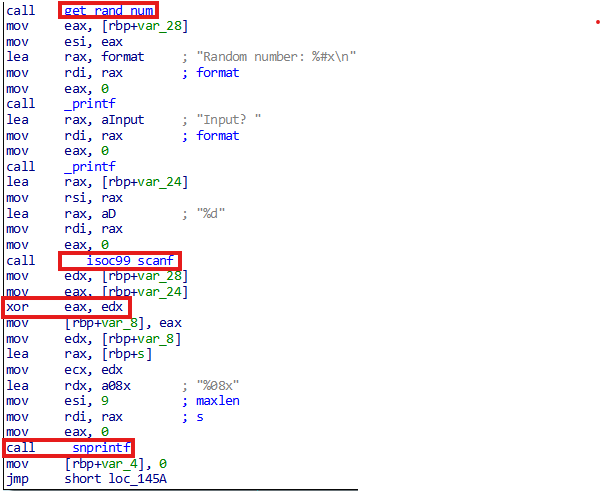
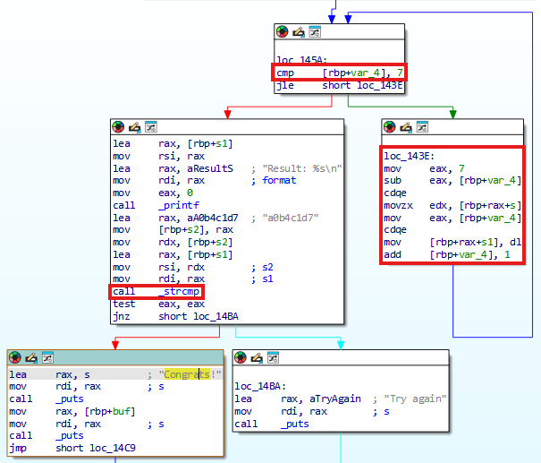
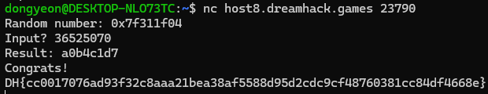

# Dreamhack: simple-operation Write-up

## 1. Problem Overview
- **Category:** Reversing
- **Difficulty:** Level 1
- **Tool:** IDA Free, VS Code (C Language), Ubuntu 24.04.1 LTS
- **Description:** 프로그램에서 랜덤으로 생성한 값과 사용자가 입력한 값을 XOR 연산하고, 그 결과를 내부의 특정 문자열과 비교하는 문제

## 2. Static Analysis (정적 분석)
### 2.1. Main Logic Finding
`Congrats!` 문자열을 Xref하여 메인 함수를 찾았습니다.
해당 함수를 분석한 결과, 먼저 `get_rand_num` 함수를 통해 생성된 난수와 사용자가 10진수로 입력한 수를 XOR 연산합니다.
이후 연산 결과를 `snprintf` 함수를 사용하여 문자열 `s`에 저장하는 것을 확인할 수 있습니다.



아래 Graph View의 `cmp [rbp+var4], 7` 명령어를 통해 `rbp+var4`가 인덱스 역할을 하며, 반복문이 인덱스 0부터 7까지 수행된다는 것을 알 수 있습니다.
`loc_143E` 블록이 복잡해 보일 수 있으나, `rbp+var4`가 인덱스임을 파악하면 단순히 `s1[index] = s[7-index]` 연산을 수행하고 있음을 알 수 있습니다. 즉, 문자열을 역순으로 재배치하는 과정입니다.

반복문이 종료되면 `strncmp` 함수를 통해 결과 문자열을 하드코딩된 비교 문자열 "a0b4c1d7"과 비교합니다.


### 2.2. Assembly to C Reconstruction (핵심)
분석한 어셈블리 코드를 바탕으로 C언어 의사 코드(Pseudo-code)로 복원했습니다. 핵심 로직은 **XOR연산을 한 후 문자열로 변환**하는 과정입니다.


**[Reconstructed C Code]**
```c
void main() {
    // 랜덤 값 생성 
    int random_val = get_rand_num(); 
    int user_input;

    // 사용자 입력 (Decimal)
    scanf("%d", &user_input);

    // XOR 연산 및 문자열 변환
    int xor_result = random_val ^ user_input;
    char s[9], s1[9];
    
    // xor 결과를 16진수 문자열로 변환하여 s에 저장
    snprintf(s, 9, "%08x", xor_result);

    // 문자열 순서 뒤집기 
    // IDA 분석: s1[index] = s[7 - index]
    for (int i = 0; i < 8; i++) {
        s1[i] = s[7 - i];
    }
   

    // 하드코딩된 문자열과 비교
    if (strncmp(s1, "a0b4c1d7", 8) == 0) {
        puts("Congrats!"); // 플래그 출력 성공 루틴
    } else {
        puts("Wrong...");
    }
}

```

## 3. Solution (풀이 과정)
분석한 로직에 따라 정답을 구하는 식은 Input = random_number ^ 0x7d1c4b0a입니다. 따라서 실행 시 주어지는 랜덤 값만 알면 XOR 연산을 통해 정답을 도출할 수 있습니다.



서버로부터 받은 Random number는 0x7f311f04였으며, 이를 0x7d1c4b0a와 XOR 연산하여 결과값 36525070 (10진수)을 얻었습니다. 이 값을 서버에 입력하여 최종적으로 플래그를 획득했습니다.

## 4. Thoughts
rev-basic 시리즈를 풀며 특정 문제 유형에만 고착화되어 있었음을 깨달았습니다. 새로운 패턴의 문제에서 어려움을 겪으며, 단순한 풀이 반복보다는 근본적인 실력 향상이 필요함을 느꼈습니다.
어셈블리 기초 강의를 복습한 후 분석 시야가 넓어진 것을 체감했으며, 이번 문제를 통해 탄탄한 기본기의 중요성을 다시 한번 확인하는 계기가 되었습니다.


