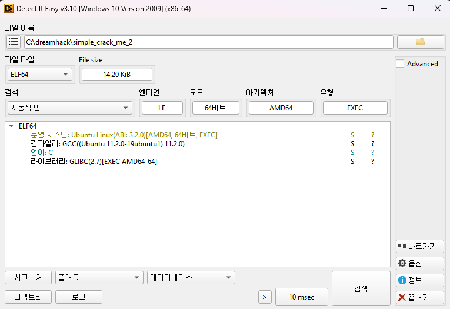
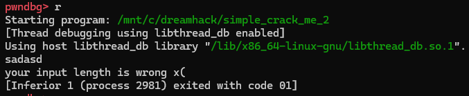
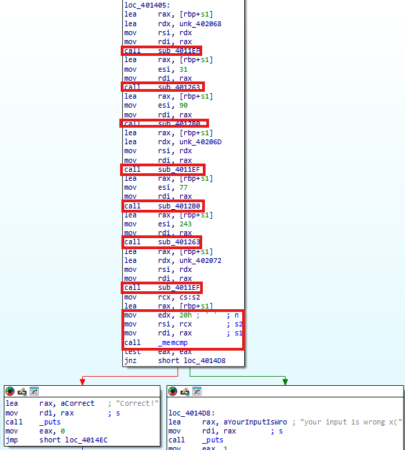
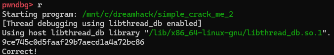

# Dreamhack: simple_crack_me2 Write-up

## 1. Problem Overview
- **Category:** Reversing
- **Difficulty:** Level 2
- **Tool:** IDA Free, VS Code (C Language), pwndbg
- **Description:** Correct를 출력해내는 사용자 입력값을 찾는 문제

## 2. Static Analysis (정적 분석)
### 2.1. Initial Analysis
제공된 simple_crack_me2 파일에 확장자가 없어 파일 형식을 식별하기 위해 정적 분석 도구인 DIE (Detect It Easy) 를 사용했습니다. 분석 결과, 해당 파일이 리눅스 실행 파일(ELF 64-bit)임을 확인했습니다.

Reference: DIE는 실행 파일의 컴파일러, 패커, 파일 형식 등을 상세히 알려주는 도구입니다.



이후 pwndbg를 사용해 리눅스환경에서 프로그램을 실행하여 동작을 확인했습니다.

Reference: pwndbg는 리눅스 터미널 디버거인 GDB(GNU Debugger)를 해킹과 리버싱에 최적화된 형태로 개조해 주는 강력한 플러그인입니다.



### 2.2 Main Logic Finding
**Correct!** 성공 문자열을 Cross Reference (Xref) 하여 메인 로직이 위치한 함수를 찾았습니다.




**[Assembly Code]**
```assembly
mov     eax, [rsp+18h+var_18]   ; i (index) 값을 가져옴
and     eax, 7                  ; i & 7 (회전 횟수 계산)
movsxd  rcx, [rsp+18h+var_18]
mov     [rsp+18h+var_10], rcx   ; (메모리 정리 과정)
mov     rdx, [rsp+18h+arg_0]    ; 입력값 배열 주소
movzx   ecx, al                 ; ecx = 회전 횟수 (i & 7)
mov     rax, [rsp+18h+var_10]
movzx   eax, byte ptr [rdx+rax] ; eax = input[i] (1바이트 로드)
rol     al, cl                  ; ROL (Rotate Left) al, cl
movzx   eax, al
xor     eax, [rsp+18h+var_18]   ; Result ^ i (XOR)
lea     rdx, unk_140003000      ; 비교할 데이터(data) 주소 로드
cmp     eax, ecx                ; 최종 비교 (Compare)
```

**[Reconstructed C Code]**
```c

#include <stdbool.h> // bool, true, false 사용을 위해

// ROL (Rotate Left) 함수 구현
// C언어에는 비트 회전 연산자가 없으므로 Shift(<<, >>)와 OR(|)를 조합해 구현
unsigned char ROL(unsigned char value, int cnt)
{
    // 8비트 자료형이므로 8번 회전하면 제자리로 돌아옴
    cnt = cnt % 8;

    /* [구현 예시] 
       값: 1000 0011 (0x83), 1비트 왼쪽 회전 시 (ROL 1)
       
       1. value << cnt      : 0000 0110 (왼쪽으로 밀고, 오른쪽은 0으로 채움)
       2. value >> (8-cnt)  : 0000 0001 (밀려난 최상위 비트가 맨 뒤로 이동)
       3. OR 연산 (|)       : 0000 0111 (두 결과를 합침 -> 회전 완료)
    */
    return (value << cnt) | (value >> (8 - cnt));
}

bool check(char* input, char* data, int len)
{
 
    for (int i = 0; i < len; i++)
    {
        // [검증 로직]
        // 1. 입력 문자(input[i])를 (i & 7)만큼 왼쪽으로 회전 (ROL)
        // 2. 그 결과를 인덱스(i)와 XOR 연산
        // 3. 미리 정의된 데이터(data[i])와 비교
        if ( (ROL(input[i], i & 7) ^ i) != data[i] )
        {
            return false; // 하나라도 다르면 검증 실패
        }
    }

    return true; // 모든 검증 통과
}
```

## 3. Solution (풀이 과정)
정적 분석을 통해 파악한 암호화 루틴은 Input -> ROL -> XOR -> Data 순서로 진행됩니다. 따라서 원본 플래그(Input)를 복구하기 위해서는 연산 순서를 역순으로 뒤집고, 각 연산의 역함수(Inverse Function)를 적용해야 합니다. ex) ROL대신 ROR적용


Step 1 (XOR 복구): XOR 연산의 역연산은 자기 자신이므로, 데이터(Data)에 인덱스(i)를 다시 XOR 합니다.

Step 2 (Rotate 복구): ROL(왼쪽 회전)의 역연산은 ROR(오른쪽 회전) 이므로, Step 1의 결과를 (i & 7)만큼 오른쪽으로 회전시킵니다.

### Full Solver Code
[solution.c](./solution.c) 파일을 참고하세요.

## 4. Result
플래그 추출 성공: `DH{Roll_the_left!_Roll_the_right!}`



## 5. Thoughts
시리즈의 후반부로 갈수록 어셈블리 코드의 복잡도가 높아짐을 체감한다. 이번 문제에서 ROL과 XOR이라는 핵심 암호화 로직은 성공적으로 파악하여 C언어로 복원했지만, 분석 과정에서 **스택 프레임 초기화 및 메모리 정리**와 같은 점을 실제 로직으로 오인하여 시간을 소모했다.
모든 어셈블리 명령어를 해석하려 하기보다, 전체적인 흐름을 먼저 파악하는 것의 중요성을 깨달았다. 또한, 정적 분석(Static Analysis)만으로는 메모리 값의 변화를 추적하는 데 한계가 있음을 느꼈다. 앞으로는 **x64dbg와 같은 동적 분석 도구**를 적극 도입하여 좀 더 발전해야겠다.


